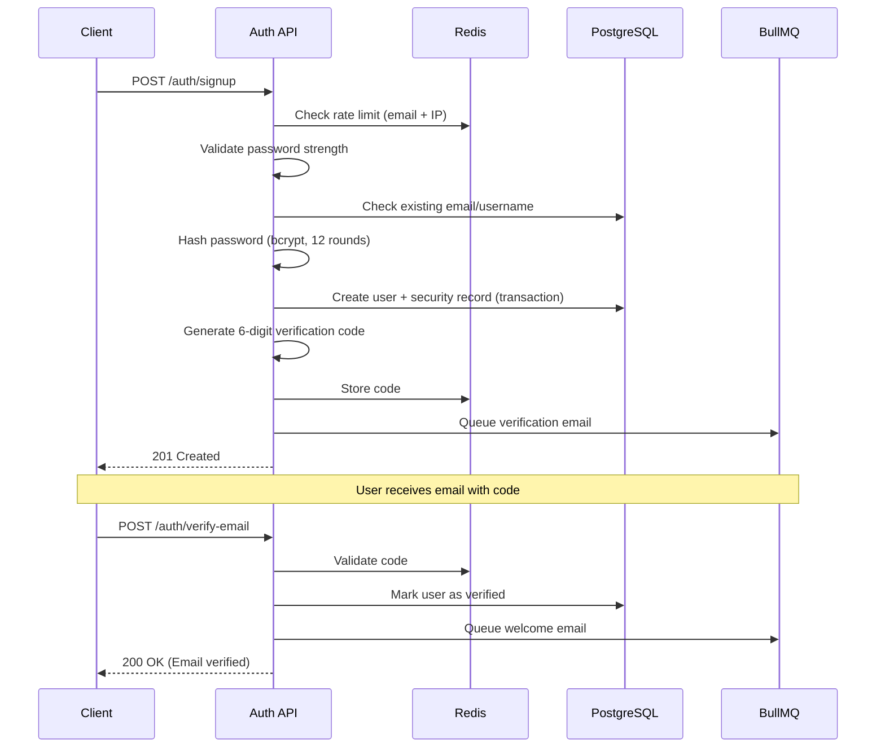
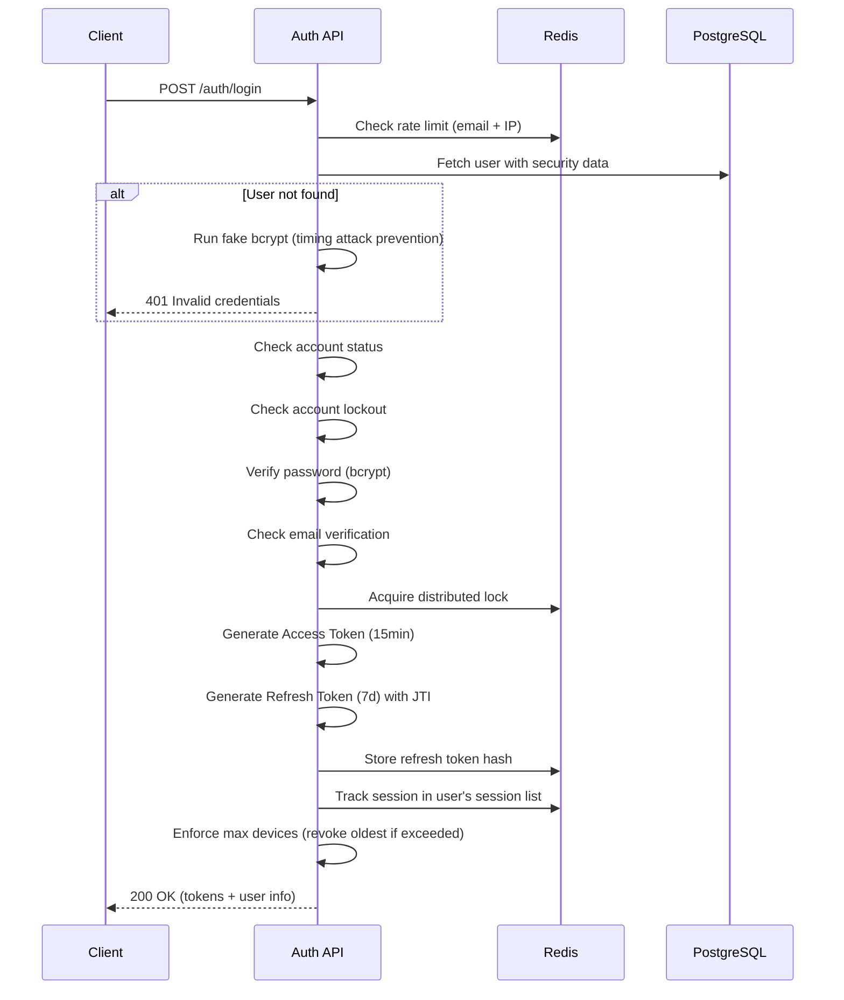
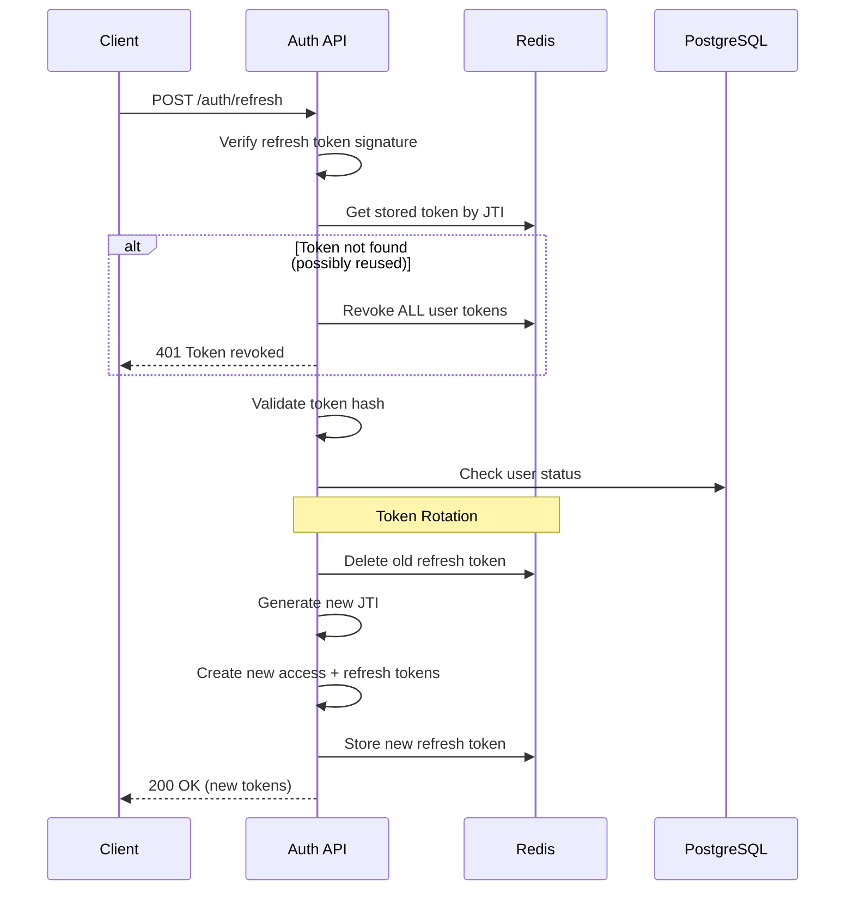
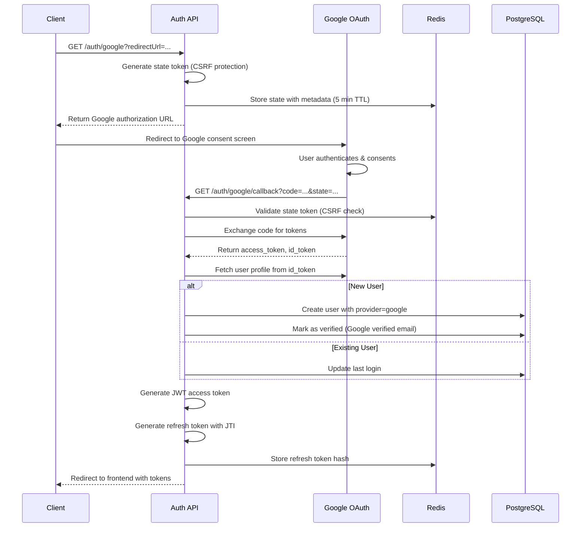
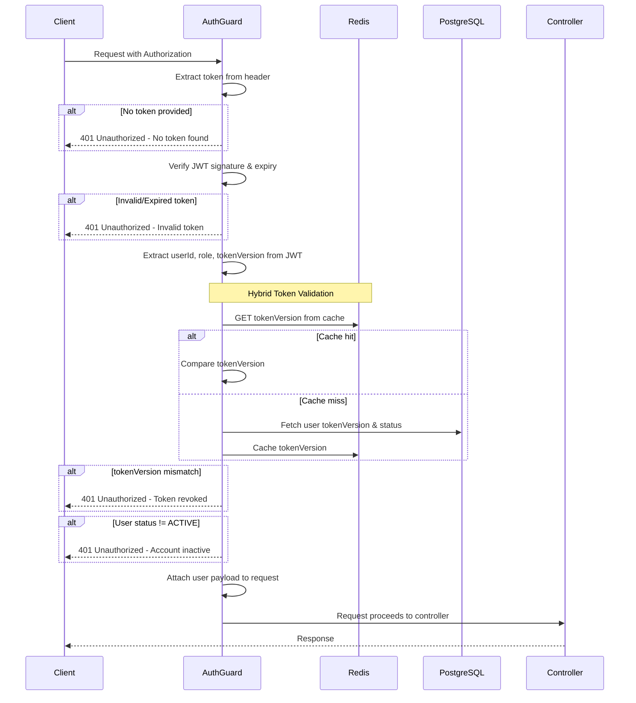
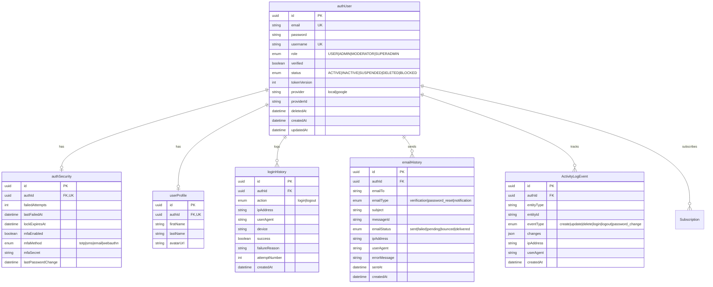
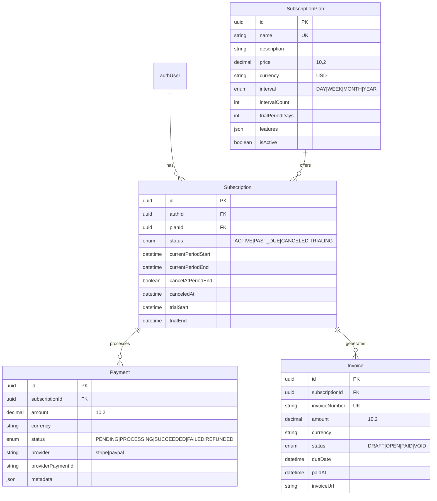
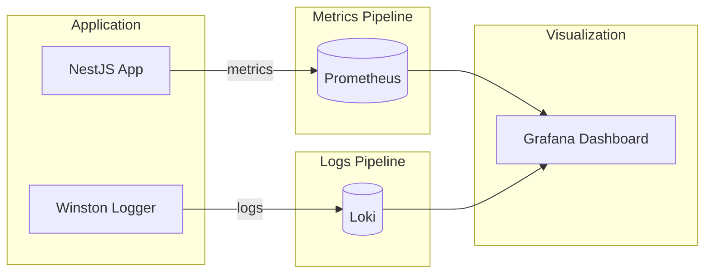

<p align="center">
  <a href="http://nestjs.com/" target="blank"></a>
</p>

<h1 align="center">NestJS + Prisma + PostgreSQL Starter Template</h1>

<p align="center">
  A production-ready, enterprise-grade starter template for building scalable backend applications with NestJS, Prisma ORM, and PostgreSQL.
</p>

<p align="center">
  <a href="https://www.npmjs.com/~nestjscore" target="_blank"></a>
  <a href="https://www.npmjs.com/~nestjscore" target="_blank"></a>
  
  
  
</p>

---

## 📋 Table of Contents

> Frontend team: use the [API documentation folder](docs/api/README.md) for implementation order, OpenAPI contracts, Postman collection, examples, and complete user flows.

- [Why This Starter?](#-why-this-starter)
- [Features](#-features)
- [Tech Stack](#-tech-stack)
- [Quick Start](#-quick-start)
- [System Overview](#-system-overview)
  - [Authentication System](#authentication-system)
  - [Database Design](#-database-design)
- [Project Structure](#-project-structure)
- [Getting Started](#-getting-started)
- [API Documentation](#-api-documentation)
- [Environment Configuration](#-environment-configuration)
- [API Reference](#-api-reference)
- [Adding Protected Routes](#-adding-protected-routes)
- [Extending the Template](#-extending-the-template)
- [Frontend Integration](#-frontend-integration)
- [Error Handling](#-error-handling)
- [Docker Setup](#-docker-setup)
- [Monitoring Stack](#-monitoring-stack)
- [CI/CD Pipeline](#-cicd-pipeline)
- [Testing](#-testing)
- [Production Deployment](#-production-deployment)
- [Security Best Practices](#-security-best-practices)
- [Troubleshooting](#-troubleshooting)
- [Contributing](#-contributing)
- [License](#-license)

---

## 🌟 Why This Starter?

This isn't just another boilerplate—it's a **battle-tested, production-grade foundation** that implements enterprise security patterns and best practices out of the box:

| Feature | Why It Matters |
|---------|----------------|
| **JWT + Refresh Token Rotation** | Prevents token theft with automatic rotation on each refresh |
| **Rate Limiting & Account Lockout** | Protects against brute force attacks |
| **Timing Attack Prevention** | Consistent response times prevent user enumeration |
| **Distributed Locks (Redis)** | Prevents race conditions in concurrent operations |
| **Token Version for Instant Revocation** | Immediately invalidate all user sessions on security events |
| **Centralized Logging (Loki)** | Aggregate logs from all services for debugging |
| **Prometheus Metrics** | Real-time performance monitoring and alerting |
| **Multi-stage Docker Builds** | Optimized production images (~50% smaller) |

---

## 🚀 Quick Start

Get up and running in 5 minutes:

```bash
# 1. Clone the repository
git clone https://github.com/the-pujon/nestjs-prisma-postgresql-hexagon.git
cd nestjs-prisma-postgresql-hexagon

# 2. Create environment file
cp .env.example .env

# 3. Start Docker services (PostgreSQL, Redis, Prometheus, Grafana, Loki)
docker compose up -d

# 4. Install dependencies
npm install

# 5. Push Prisma schema to PostgreSQL
npx prisma migrate dev

# 6. Start the development server
npm run start:dev
```

**Verify installation:**
- API Health: http://localhost:5000
- API Docs: Import `docs/api/postman-collection.json` into Postman
- Mongo Express: http://localhost:8081
- RedisInsight: http://localhost:8001
- Grafana: http://localhost:3000 (admin / admin)
- Prometheus: http://localhost:9090

---

## ✨ Features

### 🔐 Authentication & Security
- **JWT Authentication** with access & refresh tokens
- **Token Rotation** - New refresh token on each refresh (prevents token theft)
- **Email Verification** with 6-digit OTP codes (24h expiry)
- **Google OAuth 2.0** - Complete social login integration
- **Rate Limiting** (per-email, per-IP based)
- **Account Lockout** - 30 min lockout after 5 failed attempts
- **Password Strength Validation** - Min 8 chars with complexity requirements
- **Hybrid Token Validation** (Redis cache + DB fallback for speed)
- **Timing Attack Prevention** - Consistent response times

### 📧 Email System (BullMQ)
- **Async Email Processing** with BullMQ job queue
- **Automatic Retries** - 3 attempts with exponential backoff
- **Email Templates** - HTML templates for verification & welcome emails
- **Email History Tracking** - Full audit trail in database
- **Multiple Email Types** - Verification, password reset, notifications

### 🔗 OAuth Integration
- **Google OAuth 2.0** - Login with Google account
- **Provider Abstraction** - Easy to add more providers (GitHub, Facebook)
- **Account Linking** - Link OAuth to existing accounts
- **Secure Callback Handling** - State validation and token exchange

### 📦 Infrastructure
- **PostgreSQL 7** with Prisma ORM (modular schema)
- **Redis Stack** for caching, sessions, and distributed locks
- **BullMQ** for background job processing (emails, notifications)
- **Docker Compose** for local development
- **Multi-stage Docker builds** for production (~50% smaller images)

### 📊 Monitoring & Observability
- **Prometheus** metrics collection (request duration, errors, active users)
- **Grafana** dashboards (auto-provisioned)
- **Loki** log aggregation (structured JSON logs)
- **Winston** structured logging with multiple transports
- **Health checks** on startup

### 🚀 Developer Experience
- **TypeScript 5.7** with strict mode
- **ESLint + Prettier** configured
- **Unit tests** with Jest + mocks
- **Postman collection** included (all endpoints)
- **Hot reload** in development
- **CI/CD** with GitHub Actions (Docker Hub + EC2)

---

## 🛠 Tech Stack

| Category | Technology |
|----------|------------|
| **Framework** | NestJS 11 |
| **Language** | TypeScript 5.7 |
| **ORM** | Prisma 7 |
| **Database** | PostgreSQL 7 |
| **Cache/Queue** | Redis Stack (with RedisInsight UI) |
| **Job Queue** | BullMQ |
| **Auth** | JWT (jsonwebtoken) |
| **Validation** | class-validator, class-transformer |
| **Logging** | Winston + Loki |
| **Metrics** | Prometheus (prom-client) |
| **Visualization** | Grafana |
| **Email** | Nodemailer |
| **Testing** | Jest |
| **Containerization** | Docker, Docker Compose |
| **CI/CD** | GitHub Actions |

---

# 🔐 System Overview

## Authentication System

### Registration Flow



### Login Flow



### Token Refresh Flow



### Google OAuth Flow



### Auth Guard & Authorization Flow




### Security Features

| Feature | Configuration | File |
|---------|---------------|------|
| **Access Token Expiry** | 15 minutes | `src/auth/config/auth.config.ts` |
| **Refresh Token Expiry** | 7 days | `src/auth/config/auth.config.ts` |
| **Max Login Attempts** | 5 per 15 minutes | `src/auth/config/auth.config.ts` |
| **Account Lockout** | 30 minutes after max attempts | `src/auth/config/auth.config.ts` |
| **Max Devices per User** | 5 simultaneous sessions | `src/auth/config/auth.config.ts` |
| **Password Requirements** | Min 8 chars, uppercase, lowercase, number, special char | `src/auth/config/auth.config.ts` |
| **Verification Code Expiry** | 24 hours | `src/auth/config/auth.config.ts` |

### Customizing Auth Configuration

To modify authentication settings, edit `src/auth/config/auth.config.ts`:

```typescript
export const AUTH_CONFIG = {
  // Password Configuration
  PASSWORD_MIN_LENGTH: 8,
  PASSWORD_REQUIREMENTS: {
    UPPERCASE: true,
    LOWERCASE: true,
    NUMBERS: true,
    SPECIAL_CHARS: true,
  },

  // Token Configuration - Modify expiry times
  TOKEN_EXPIRY: {
    ACCESS: '15m',     // Short-lived for security
    REFRESH: '7d',     // 7 days
    VERIFICATION: '24h',
    PASSWORD_RESET: '1h',
  },

  // Rate Limiting
  RATE_LIMIT: {
    LOGIN_MAX_ATTEMPTS: 5,
    LOGIN_WINDOW_MS: 15 * 60 * 1000, // 15 minutes
  },

  // Account Lockout
  ACCOUNT_LOCKOUT: {
    MAX_FAILED_ATTEMPTS: 5,
    LOCKOUT_DURATION_MS: 30 * 60 * 1000, // 30 minutes
  },

  // Session/Device Management
  SESSION: {
    MAX_DEVICES_PER_USER: 5,
  },
} as const;
```

### API Endpoints

| Method | Endpoint | Auth | Description |
|--------|----------|------|-------------|
| `POST` | `/auth` | ❌ | Register new user |
| `POST` | `/auth/verify-email` | ❌ | Verify email with OTP |
| `POST` | `/auth/resend-verification-email` | ❌ | Resend verification email |
| `POST` | `/auth/login` | ❌ | Login and get tokens |
| `POST` | `/auth/refresh-token` | ❌ | Refresh access token |
| `POST` | `/auth/logout` | ❌ | Logout (revoke refresh token) |
| `POST` | `/auth/logout-all` | ❌ | Logout all devices |
| `GET` | `/auth/google` | ❌ | Initiate Google OAuth |
| `GET` | `/auth/google/callback` | ❌ | Google OAuth callback |
| `POST` | `/auth/google/callback` | ❌ | Google OAuth callback (POST) |
| `GET` | `/user` | ❌* | List all users |
| `GET` | `/user/:id` | ❌* | Get user by ID |
| `PATCH` | `/user/:id` | ❌* | Update user |
| `DELETE` | `/user/:id` | ❌* | Delete user |
| `GET` | `/` | ❌ | Health check |
| `GET` | `/metrics` | ❌ | Prometheus metrics |

> *Note: User endpoints are currently public. See [Adding Protected Routes](#-adding-protected-routes) to secure them.

---

## 🗄️ Database Design

### Core Authentication Schema



### Subscription & Billing Schema



### Enums

```typescript
// User Roles
enum userRole {
  USER
  ADMIN
  MODERATOR
  SUPERADMIN
}

// User Status
enum userStatus {
  ACTIVE
  INACTIVE
  SUSPENDED
  DELETED
  BLOCKED
}

// Subscription Status
enum subscriptionStatus {
  ACTIVE
  PAST_DUE
  CANCELED
  TRIALING
  INCOMPLETE
  INCOMPLETE_EXPIRED
  UNPAID
}

// Billing Interval
enum billingInterval {
  DAY
  WEEK
  MONTH
  YEAR
}
```

### Syncing the PostgreSQL Schema

```bash
# PostgreSQL does not use Prisma migrations.
# Push schema changes directly to the database.
npx prisma migrate dev

# Generate Prisma Client
npx prisma generate
```

---


## 📁 Project Structure

```
nestjs-prisma-postgresql-hexagon/
├── 📂 src/
│   ├── 📂 auth/                    # Authentication module
│   │   ├── 📂 config/              # Auth configuration (timeouts, limits)
│   │   ├── 📂 dto/                 # Data transfer objects
│   │   ├── 📂 interfaces/          # TypeScript interfaces
│   │   ├── 📂 services/            # Auth utility services
│   │   ├── auth.controller.ts      # Auth endpoints
│   │   ├── auth.service.ts         # Core auth business logic
│   │   └── auth.module.ts          # Module definition
│   │
│   ├── 📂 common/                  # Shared utilities
│   │   ├── 📂 config/              # App & Winston configuration
│   │   ├── 📂 dto/                 # Shared DTOs
│   │   ├── 📂 errors/              # Custom error classes
│   │   ├── 📂 filters/             # Exception filters
│   │   ├── 📂 guards/              # Auth guards
│   │   ├── 📂 interceptors/        # Response & metrics interceptors
│   │   ├── 📂 modules/             # Logger, Redis, Queue modules
│   │   ├── 📂 queues/              # BullMQ email queue
│   │   └── 📂 services/            # Prisma, Redis, Logger services
│   │
│   ├── 📂 metrics/                 # Prometheus metrics
│   │   ├── metrics.controller.ts   # /metrics endpoint
│   │   ├── metrics.service.ts      # Metric definitions
│   │   └── metrics.interceptor.ts  # Request tracking
│   │
│   ├── 📂 user/                    # User management module
│   │   ├── 📂 dto/                 # User DTOs
│   │   ├── user.controller.ts      # User endpoints
│   │   └── user.service.ts         # User business logic
│   │
│   ├── app.module.ts               # Root module
│   ├── app.controller.ts           # Health check endpoint
│   └── main.ts                     # Application bootstrap
│
├── 📂 prisma/
│   ├── 📂 schema/                  # Modular Prisma schemas
│   │   ├── base.prisma             # Generator & datasource config
│   │   ├── enums.prisma            # All enums
│   │   ├── auth.prisma             # AuthUser, AuthSecurity models
│   │   ├── profile.prisma          # UserProfile model
│   │   ├── history.prisma          # LoginHistory, EmailHistory
│   │   ├── activityLog.prisma      # Activity logging
│   │   └── subscription.prisma     # Subscription, Payment, Invoice
│   └── No migrations directory     # PostgreSQL uses prisma db push
│
├── 📂 monitoring/
│   ├── 📂 prometheus/              # Prometheus config
│   ├── 📂 grafana/                 # Grafana provisioning
│   └── 📂 loki/                    # Loki configuration
│
├── 📂 templates/
│   └── 📂 emails/                  # Email HTML templates
│
├── 📂 test/                        # E2E tests
├── docker-compose.yaml             # Development services
├── docker-compose.prod.yaml        # Production backend
├── docker-compose.override.yaml    # Development overrides
├── Dockerfile                      # Multi-stage build
├── .env.example                    # Environment template
└── docs/api/                       # Frontend guide, OpenAPI and Postman files
```

---

## 🚀 Getting Started

### Prerequisites

- **Node.js** ≥ 22
- **npm** ≥ 10
- **Docker** & **Docker Compose**
- **Git**

### Installation

1. **Clone the repository**
   ```bash
   git clone https://github.com/the-pujon/nestjs-prisma-postgresql-hexagon.git
   cd nestjs-prisma-postgresql-hexagon
   ```

2. **Create environment file**
   ```bash
   cp .env.example .env
   ```

3. **Update `.env`** with your configuration (see [Environment Configuration](#-environment-configuration))

4. **Start Docker services**
   ```bash
   # Start all services (PostgreSQL, Redis, Prometheus, Grafana, Loki)
   docker compose up -d
   ```

5. **Install dependencies**
   ```bash
   npm install
   ```

6. **Push Prisma schema to PostgreSQL**
   ```bash
   npx prisma migrate dev
   ```

7. **Generate Prisma client**
   ```bash
   npx prisma generate
   ```

7. **Start the application**
   ```bash
   # Development mode with hot reload
   npm run start:dev
   
   # Or production mode
   npm run build && npm run start:prod
   ```

### Available NPM Scripts

| Script | Description |
|--------|-------------|
| `npm run start:dev` | Start in development mode with hot reload |
| `npm run start:debug` | Start in debug mode with inspector |
| `npm run start:prod` | Start in production mode |
| `npm run build` | Build the application |
| `npm run test` | Run unit tests |
| `npm run test:watch` | Run tests in watch mode |
| `npm run test:cov` | Run tests with coverage report |
| `npm run test:e2e` | Run end-to-end tests |
| `npm run lint` | Run ESLint and fix issues |
| `npm run format` | Format code with Prettier |
| `npm run docker:dev` | Start Docker services |

### Prisma Commands

| Command | Description |
|---------|-------------|
| `npx prisma generate` | Generate Prisma Client |
| `npx prisma migrate dev` | Push schema changes to PostgreSQL |
| `npx prisma studio` | Open Prisma Studio GUI |

8. **Verify installation**
   - API: http://localhost:5000
   - Mongo Express: http://localhost:8081
   - RedisInsight: http://localhost:8001
   - Prometheus: http://localhost:9090
   - Grafana: http://localhost:3000
   - Loki: http://localhost:3100

---


## 📚 API Documentation

This project includes **automatic Swagger/OpenAPI documentation** with zero configuration required.

Once the application is running, access the interactive API documentation at:

**👉 [http://localhost:5000/docs](http://localhost:5000/docs)**

### Features:
- ✅ **Zero decorators required** - DTOs are automatically documented
- ✅ **Global response format** - Consistent API responses
- ✅ **JWT authentication** - Bearer token support built-in
- ✅ **Try it out** - Test endpoints directly from the browser
- ✅ **Pagination support** - Standard pagination patterns included

For detailed information, see the [API documentation](docs/api/README.md).

---

## ⚙️ Environment Configuration

### Complete Environment Variables Reference

| Variable | Required | Default | Description |
|----------|----------|---------|-------------|
| **Database** |
| `DATABASE_URL` | ✅ | - | PostgreSQL connection string |
| `DATABASE_PORT` | ❌ | `27017` | PostgreSQL port mapping |
| `DATABASE_HOST` | ❌ | `127.0.0.1` | PostgreSQL host |
| **Application** |
| `NODE_ENV` | ❌ | `development` | Environment: `development`, `production`, `test` |
| `PORT` | ❌ | `5000` | Application port |
| **JWT Authentication** |
| `JWT_SECRET` | ✅ | - | JWT signing secret (min 256 bits) |
| `JWT_ACCESS_SECRET` | ❌ | `JWT_SECRET` | Separate secret for access tokens |
| `JWT_REFRESH_SECRET` | ❌ | `JWT_SECRET` | Separate secret for refresh tokens |
| **Redis** |
| `REDIS_HOST` | ❌ | `localhost` | Redis server host |
| `REDIS_PORT` | ❌ | `6379` | Redis server port |
| `REDIS_USER` | ❌ | `default` | Redis username |
| `REDIS_PASSWORD` | ❌ | - | Redis password |
| `REDIS_DB` | ❌ | `0` | Redis database number |
| `REDIS_CACHE_KEY_PREFIX` | ❌ | `app` | Prefix for all Redis keys |
| **Email (SMTP)** |
| `EMAIL_HOST` | ✅ | `smtp.gmail.com` | SMTP server host |
| `EMAIL_PORT` | ❌ | `587` | SMTP server port |
| `EMAIL_USER` | ✅ | - | SMTP username (email address) |
| `EMAIL_PASS` | ✅ | - | SMTP password (App Password for Gmail) |
| `EMAIL_FROM` | ❌ | `EMAIL_USER` | From address for outgoing emails |
| **Google OAuth** |
| `GOOGLE_CLIENT_ID` | ❌ | - | Google OAuth client ID |
| `GOOGLE_CLIENT_SECRET` | ❌ | - | Google OAuth client secret |
| `GOOGLE_REDIRECT_URI` | ❌ | - | OAuth callback URL |
| **Monitoring** |
| `GRAFANA_ADMIN_USER` | ❌ | `admin` | Grafana admin username |
| `GRAFANA_ADMIN_PASSWORD` | ❌ | `admin` | Grafana admin password |
| `LOKI_ENABLED` | ❌ | `true` | Enable Loki log aggregation |
| `LOKI_URL` | ❌ | `http://localhost:3100` | Loki server URL |

### Create `.env` File

Create a `.env` file based on `.env.example`:

```env
# ═══════════════════════════════════════════════════════════════
# DATABASE CONFIGURATION
# ═══════════════════════════════════════════════════════════════
DATABASE_URL=postgresql://127.0.0.1:27017/job_tracker?replicaSet=rs0&directConnection=true
DATABASE_PORT=27017
DATABASE_HOST=127.0.0.1

# ═══════════════════════════════════════════════════════════════
# APPLICATION CONFIGURATION
# ═══════════════════════════════════════════════════════════════
NODE_ENV=development
PORT=5000

# ═══════════════════════════════════════════════════════════════
# JWT CONFIGURATION
# ═══════════════════════════════════════════════════════════════
# IMPORTANT: Use a strong, random secret (at least 256 bits)
# Generate with: openssl rand -base64 32
JWT_SECRET=a-string-secret-at-least-256-bits-long

# ═══════════════════════════════════════════════════════════════
# REDIS CONFIGURATION
# ═══════════════════════════════════════════════════════════════
REDIS_HOST=localhost
REDIS_PORT=6379
REDIS_USER=default
REDIS_PASSWORD=your_redis_password

# ═══════════════════════════════════════════════════════════════
# EMAIL CONFIGURATION (Gmail SMTP)
# ═══════════════════════════════════════════════════════════════
EMAIL_HOST=smtp.gmail.com
EMAIL_PORT=587
EMAIL_USER=your-email@gmail.com
EMAIL_PASS=your-app-password           # Use Gmail App Password
EMAIL_FROM=noreply@yourapp.com

# ═══════════════════════════════════════════════════════════════
# GOOGLE OAUTH (Optional)
# ═══════════════════════════════════════════════════════════════
# Get credentials: https://console.cloud.google.com/apis/credentials
GOOGLE_CLIENT_ID=your-google-client-id.apps.googleusercontent.com
GOOGLE_CLIENT_SECRET=your-google-client-secret
GOOGLE_REDIRECT_URI=http://localhost:5000/auth/google/callback

# ═══════════════════════════════════════════════════════════════
# PGADMIN CONFIGURATION
# ═══════════════════════════════════════════════════════════════
PGADMIN_DEFAULT_EMAIL=admin@example.com
PGADMIN_DEFAULT_PASSWORD=admin

# ═══════════════════════════════════════════════════════════════
# MONITORING CONFIGURATION
# ═══════════════════════════════════════════════════════════════
GRAFANA_ADMIN_USER=admin
GRAFANA_ADMIN_PASSWORD=admin
LOKI_ENABLED=true
LOKI_URL=http://localhost:3100
```

### Gmail App Password Setup

1. Enable 2-Factor Authentication on your Google account
2. Go to [Google App Passwords](https://myaccount.google.com/apppasswords)
3. Generate a new app password for "Mail"
4. Use this password in `EMAIL_PASS`

---


## 📡 API Reference

### Base URL

```
Development: http://localhost:5000
Production:  https://your-domain.com
```

### Response Format

All API responses follow a consistent format:

```json
// Success Response
{
  "statusCode": 200,
  "message": "Success",
  "data": { ... }
}

// Error Response
{
  "statusCode": 400,
  "message": "Error description",
  "errors": { ... },
  "error": "AppError"
}
```

### Authentication Endpoints

#### Register User
```http
POST /auth
Content-Type: application/json

{
  "email": "user@example.com",
  "password": "SecurePass123!",
  "username": "johndoe"
}
```

**Password Requirements:**
- Minimum 8 characters
- At least 1 uppercase letter
- At least 1 lowercase letter
- At least 1 number
- At least 1 special character

**Response (201 Created):**
```json
{
  "statusCode": 201,
  "message": "Success",
  "data": null
}
```
> A verification email with 6-digit code will be sent to the user.

---

#### Verify Email
```http
POST /auth/verify-email
Content-Type: application/json

{
  "email": "user@example.com",
  "code": "123456"
}
```

**Response (200 OK):**
```json
{
  "statusCode": 200,
  "message": "Success",
  "data": {
    "message": "Email verified successfully"
  }
}
```

---

#### Resend Verification Email
```http
POST /auth/resend-verification-email
Content-Type: application/json

{
  "email": "user@example.com"
}
```

**Rate Limit:** Max 3 requests per 15 minutes per email.

---

#### Login
```http
POST /auth/login
Content-Type: application/json

{
  "email": "user@example.com",
  "password": "SecurePass123!"
}
```

**Response (200 OK):**
```json
{
  "statusCode": 200,
  "message": "Success",
  "data": {
    "accessToken": "eyJhbGciOiJIUzI1NiIsInR5cCI6IkpXVCJ9...",
    "refreshToken": "eyJhbGciOiJIUzI1NiIsInR5cCI6IkpXVCJ9...",
    "user": {
      "id": "550e8400-e29b-41d4-a716-446655440000",
      "email": "user@example.com",
      "username": "johndoe",
      "role": "USER",
      "verified": true
    },
    "expiresIn": 900
  }
}
```

**Rate Limit:** Max 5 attempts per 15 minutes per email/IP.

---

#### Refresh Token
```http
POST /auth/refresh-token
Content-Type: application/json

{
  "refreshToken": "eyJhbGciOiJIUzI1NiIsInR5cCI6IkpXVCJ9..."
}
```

**Response (200 OK):**
```json
{
  "statusCode": 200,
  "message": "Success",
  "data": {
    "accessToken": "eyJhbGciOiJIUzI1NiIsInR5cCI6IkpXVCJ9...",
    "refreshToken": "eyJhbGciOiJIUzI1NiIsInR5cCI6IkpXVCJ9...",
    "expiresIn": 900
  }
}
```

> **Note:** Token rotation is implemented. The old refresh token is invalidated, and a new one is issued.

---

#### Logout
```http
POST /auth/logout
Content-Type: application/json

{
  "refreshToken": "eyJhbGciOiJIUzI1NiIsInR5cCI6IkpXVCJ9...",
  "userId": "550e8400-e29b-41d4-a716-446655440000"
}
```

**Response (200 OK):**
```json
{
  "statusCode": 200,
  "message": "Success",
  "data": {
    "success": true,
    "message": "Logged out successfully"
  }
}
```

---

#### Logout All Devices
```http
POST /auth/logout-all
Content-Type: application/json

{
  "userId": "550e8400-e29b-41d4-a716-446655440000"
}
```

**Response (200 OK):**
```json
{
  "statusCode": 200,
  "message": "Success",
  "data": {
    "success": true,
    "message": "Logged out from all devices successfully"
  }
}
```

> **Note:** This also increments the `tokenVersion`, immediately invalidating all existing access tokens.

---

### Google OAuth Endpoints

#### Initiate Google OAuth
```http
GET /auth/google?redirectUrl=http://localhost:3000/dashboard
```

**Response (200 OK):**
```json
{
  "statusCode": 200,
  "message": "Success",
  "data": {
    "url": "https://accounts.google.com/o/oauth2/v2/auth?...",
    "state": "abc123...",
    "message": "Redirect to the provided URL to authenticate with Google"
  }
}
```

---

#### Google OAuth Callback
```http
GET /auth/google/callback?code=AUTH_CODE&state=STATE_TOKEN
```

**Browser Flow:** Redirects to `redirectUrl` with tokens as query params:
```
http://localhost:3000/dashboard?access_token=xxx&refresh_token=xxx&user_id=xxx&email=xxx&is_new_user=false
```

**API Flow (POST):**
```http
POST /auth/google/callback
Content-Type: application/json

{
  "code": "AUTH_CODE",
  "state": "STATE_TOKEN"
}
```

**Response (200 OK):**
```json
{
  "statusCode": 200,
  "message": "Success",
  "data": {
    "success": true,
    "message": "Signed in successfully via Google",
    "data": {
      "accessToken": "eyJhbGciOiJIUzI1NiIsInR5cCI6IkpXVCJ9...",
      "refreshToken": "eyJhbGciOiJIUzI1NiIsInR5cCI6IkpXVCJ9...",
      "user": {
        "id": "550e8400-e29b-41d4-a716-446655440000",
        "email": "user@gmail.com",
        "username": "user_google_123456"
      },
      "isNewUser": true
    }
  }
}
```

---

### User Endpoints

#### Get All Users
```http
GET /user
```

---

#### Get User by ID
```http
GET /user/:id
```

---

#### Update User
```http
PATCH /user/:id
Content-Type: application/json

{
  "username": "newusername"
}
```

---

#### Delete User
```http
DELETE /user/:id
```

---

### Health & Metrics

#### Health Check
```http
GET /
```

**Response:**
```json
{
  "statusCode": 200,
  "message": "Success",
  "data": "Hello World!"
}
```

---

#### Prometheus Metrics
```http
GET /metrics
```

**Response:** Prometheus text format metrics

---

### Postman Collection

Import `docs/api/postman-collection.json` into Postman for a complete API testing environment with examples.

### Example Requests

#### Register User
```bash
curl -X POST http://localhost:5000/auth/signup \
  -H "Content-Type: application/json" \
  -d '{
    "email": "user@example.com",
    "password": "SecurePass123!",
    "username": "johndoe"
  }'
```

#### Login
```bash
curl -X POST http://localhost:5000/auth/login \
  -H "Content-Type: application/json" \
  -d '{
    "email": "user@example.com",
    "password": "SecurePass123!"
  }'
```

#### Protected Route
```bash
curl -X GET http://localhost:5000/user/me \
  -H "Authorization: Bearer YOUR_ACCESS_TOKEN"
```

---

## 🔒 Adding Protected Routes

### Using AuthGuard

The template includes a pre-built `AuthGuard` that validates JWT tokens with hybrid Redis/DB verification. Here's how to protect your routes:

#### Method 1: Controller-Level Guard (Protect All Routes)

```typescript
import { Controller, Get, UseGuards } from '@nestjs/common';
import { AuthGuard } from '../common/guards/auth.guard';

@Controller('products')
@UseGuards(AuthGuard) // All routes in this controller require authentication
export class ProductController {
  @Get()
  findAll() {
    return this.productService.findAll();
  }

  @Get(':id')
  findOne(@Param('id') id: string) {
    return this.productService.findOne(id);
  }
}
```

#### Method 2: Route-Level Guard (Selective Protection)

```typescript
import { Controller, Get, Post, UseGuards, Request } from '@nestjs/common';
import { AuthGuard } from '../common/guards/auth.guard';

@Controller('products')
export class ProductController {
  @Get() // Public route - no guard
  findAll() {
    return this.productService.findAll();
  }

  @Post()
  @UseGuards(AuthGuard) // Protected route - requires authentication
  create(@Body() dto: CreateProductDto, @Request() req) {
    // Access authenticated user from request
    const userId = req.user.userId;
    const userRole = req.user.role;
    return this.productService.create(dto, userId);
  }
}
```

#### Accessing User Data in Protected Routes

When a route is protected, the `AuthGuard` attaches the user payload to the request:

```typescript
@Get('profile')
@UseGuards(AuthGuard)
getProfile(@Request() req) {
  // req.user contains: { userId, role, tokenVersion }
  console.log(req.user.userId);    // User's UUID
  console.log(req.user.role);      // 'USER' | 'ADMIN' | 'MODERATOR' | 'SUPERADMIN'
  
  return this.userService.findById(req.user.userId);
}
```

#### Creating a Custom User Decorator (Recommended)

For cleaner code, create a custom decorator:

```typescript
// src/common/decorators/user.decorator.ts
import { createParamDecorator, ExecutionContext } from '@nestjs/common';

export const CurrentUser = createParamDecorator(
  (data: string | undefined, ctx: ExecutionContext) => {
    const request = ctx.switchToHttp().getRequest();
    if (data) {
      return request.user?.[data];
    }
    return request.user;
  },
);

// Usage in controller
@Get('profile')
@UseGuards(AuthGuard)
getProfile(@CurrentUser() user) {
  return this.userService.findById(user.userId);
}

@Get('my-orders')
@UseGuards(AuthGuard)
getMyOrders(@CurrentUser('userId') userId: string) {
  return this.orderService.findByUser(userId);
}
```

#### Role-Based Access Control (RBAC)

Create a roles guard for admin-only routes:

```typescript
// src/common/guards/roles.guard.ts
import { Injectable, CanActivate, ExecutionContext } from '@nestjs/common';
import { Reflector } from '@nestjs/core';

@Injectable()
export class RolesGuard implements CanActivate {
  constructor(private reflector: Reflector) {}

  canActivate(context: ExecutionContext): boolean {
    const requiredRoles = this.reflector.get<string[]>('roles', context.getHandler());
    if (!requiredRoles) {
      return true;
    }
    const { user } = context.switchToHttp().getRequest();
    return requiredRoles.includes(user.role);
  }
}

// Create roles decorator
// src/common/decorators/roles.decorator.ts
import { SetMetadata } from '@nestjs/common';
export const Roles = (...roles: string[]) => SetMetadata('roles', roles);

// Usage
@Get('admin/users')
@UseGuards(AuthGuard, RolesGuard)
@Roles('ADMIN', 'SUPERADMIN')
getAllUsers() {
  return this.userService.findAll();
}
```

---

## 🔧 Extending the Template

### Adding a New Module

Let's add a complete `Product` module as an example:

#### Step 1: Generate Module Files

```bash
# Generate module, controller, and service
nest g module product
nest g controller product
nest g service product
```

#### Step 2: Add Prisma Schema

Create `prisma/schema/product.prisma`:

```prisma
model Product {
    id          String   @id @default(uuid())
    name        String
    description String?
    price       Decimal  @db.Decimal(10, 2)
    stock       Int      @default(0)
    isActive    Boolean  @default(true)
    createdBy   String
    createdAt   DateTime @default(now())
    updatedAt   DateTime @updatedAt

    // Relations
    creator     authUser @relation(fields: [createdBy], references: [id])

    @@index([name])
    @@index([createdBy])
}
```

Don't forget to add the relation in `auth.prisma`:

```prisma
model authUser {
    // ... existing fields
    products          Product[]
}
```

#### Step 3: Push Schema

```bash
npx prisma migrate dev
```

#### Step 4: Create DTOs

Create `src/product/dto/create-product.dto.ts`:

```typescript
import { IsString, IsNumber, IsOptional, Min, MaxLength } from 'class-validator';

export class CreateProductDto {
  @IsString()
  @MaxLength(200)
  name: string;

  @IsString()
  @IsOptional()
  @MaxLength(2000)
  description?: string;

  @IsNumber({ maxDecimalPlaces: 2 })
  @Min(0)
  price: number;

  @IsNumber()
  @Min(0)
  @IsOptional()
  stock?: number;
}
```

#### Step 5: Implement Service

```typescript
// src/product/product.service.ts
import { Injectable } from '@nestjs/common';
import { PrismaService } from '../common/services/prisma.service';
import { CustomLoggerService } from '../common/services/custom-logger.service';
import { ActivityLogService } from '../common/services/activity-log.service';
import { CreateProductDto } from './dto/create-product.dto';
import AppError from '../common/errors/app.error';

@Injectable()
export class ProductService {
  constructor(
    private readonly prisma: PrismaService,
    private readonly logger: CustomLoggerService,
    private readonly activityLog: ActivityLogService,
  ) {}

  async create(dto: CreateProductDto, userId: string, meta: { ip: string; userAgent: string }) {
    this.logger.log(`Creating product: ${dto.name}`, 'ProductService');

    const product = await this.prisma.$transaction(async (tx) => {
      const created = await tx.product.create({
        data: {
          ...dto,
          createdBy: userId,
        },
      });

      // Log activity
      await this.activityLog.logCreate(
        'product',
        created.id,
        { name: dto.name, price: dto.price },
        { ip: meta.ip, userAgent: meta.userAgent, actionedBy: userId },
        tx,
      );

      return created;
    });

    return product;
  }

  async findAll(page = 1, limit = 10) {
    const skip = (page - 1) * limit;
    
    const [products, total] = await Promise.all([
      this.prisma.product.findMany({
        where: { isActive: true },
        skip,
        take: limit,
        orderBy: { createdAt: 'desc' },
      }),
      this.prisma.product.count({ where: { isActive: true } }),
    ]);

    return {
      data: products,
      meta: {
        total,
        page,
        limit,
        totalPages: Math.ceil(total / limit),
      },
    };
  }

  async findOne(id: string) {
    const product = await this.prisma.product.findUnique({
      where: { id },
    });

    if (!product) {
      throw AppError.notFound('Product not found');
    }

    return product;
  }
}
```

#### Step 6: Implement Controller

```typescript
// src/product/product.controller.ts
import { Controller, Get, Post, Body, Param, Query, UseGuards, Request } from '@nestjs/common';
import { ProductService } from './product.service';
import { CreateProductDto } from './dto/create-product.dto';
import { AuthGuard } from '../common/guards/auth.guard';

@Controller('products')
export class ProductController {
  constructor(private readonly productService: ProductService) {}

  @Post()
  @UseGuards(AuthGuard)
  create(@Body() dto: CreateProductDto, @Request() req) {
    const meta = {
      ip: req.ip || 'unknown',
      userAgent: req.headers['user-agent'] || 'unknown',
    };
    return this.productService.create(dto, req.user.userId, meta);
  }

  @Get()
  findAll(@Query('page') page = 1, @Query('limit') limit = 10) {
    return this.productService.findAll(+page, +limit);
  }

  @Get(':id')
  findOne(@Param('id') id: string) {
    return this.productService.findOne(id);
  }
}
```

#### Step 7: Update Module

```typescript
// src/product/product.module.ts
import { Module } from '@nestjs/common';
import { ProductController } from './product.controller';
import { ProductService } from './product.service';
import { PrismaService } from '../common/services/prisma.service';
import { CustomLoggerService } from '../common/services/custom-logger.service';
import { ActivityLogService } from '../common/services/activity-log.service';
import { RedisService } from '../common/services/redis.service';

@Module({
  controllers: [ProductController],
  providers: [
    ProductService,
    PrismaService,
    CustomLoggerService,
    ActivityLogService,
    RedisService,
  ],
})
export class ProductModule {}
```

### Adding Caching with Redis

Use the built-in `RedisService` for caching:

```typescript
import { Injectable } from '@nestjs/common';
import { RedisService } from '../common/services/redis.service';
import { PrismaService } from '../common/services/prisma.service';

@Injectable()
export class ProductService {
  constructor(
    private readonly redis: RedisService,
    private readonly prisma: PrismaService,
  ) {}

  async findOne(id: string) {
    const cacheKey = `product:${id}`;
    
    // Try cache first
    const cached = await this.redis.get(cacheKey);
    if (cached) {
      return cached;
    }

    // Fetch from database
    const product = await this.prisma.product.findUnique({
      where: { id },
    });

    if (product) {
      // Cache for 1 hour
      await this.redis.set(cacheKey, product, 3600);
    }

    return product;
  }

  async update(id: string, data: any) {
    const product = await this.prisma.product.update({
      where: { id },
      data,
    });

    // Invalidate cache
    await this.redis.del(`product:${id}`);

    return product;
  }
}
```

### Adding Background Jobs

Use the existing BullMQ setup to add new job types:

```typescript
// src/common/queues/notification/notification.queue.ts
import { InjectQueue } from '@nestjs/bullmq';
import { Injectable } from '@nestjs/common';
import { Queue } from 'bullmq';

@Injectable()
export class NotificationQueueService {
  constructor(@InjectQueue('notification') private notificationQueue: Queue) {}

  async sendPushNotification(userId: string, title: string, body: string) {
    await this.notificationQueue.add(
      'push-notification',
      { userId, title, body },
      {
        attempts: 3,
        backoff: { type: 'exponential', delay: 1000 },
      },
    );
  }
}
```

Register the queue in `src/common/modules/queue.module.ts`:

```typescript
@Module({
  imports: [
    BullModule.registerQueue(
      { name: 'email' },
      { name: 'notification' }, // Add new queue
    ),
  ],
  // ...
})
```

#### Step 2: Create the Processor (Worker)

The processor picks jobs from the queue and processes them:

```typescript
// src/common/queues/notification/notification.processor.ts
import { Processor, WorkerHost } from '@nestjs/bullmq';
import { Inject } from '@nestjs/common';
import { Job } from 'bullmq';
import { WINSTON_MODULE_PROVIDER } from 'nest-winston';
import { Logger } from 'winston';

// Define job data interface
export interface PushNotificationJob {
  userId: string;
  title: string;
  body: string;
}

@Processor('notification') // Must match queue name
export class NotificationProcessor extends WorkerHost {
  constructor(
    @Inject(WINSTON_MODULE_PROVIDER)
    private readonly logger: Logger,
  ) {
    super();
  }

  // This method is called automatically when a job is picked from the queue
  async process(job: Job<PushNotificationJob>): Promise<void> {
    this.logger.info(`Processing notification job: ${job.name} (ID: ${job.id})`, {
      context: 'NotificationProcessor',
      jobId: job.id,
      jobName: job.name,
    });

    try {
      const { userId, title, body } = job.data;

      // Your notification logic here
      await this.sendPushNotification(userId, title, body);

      this.logger.info(`Notification sent successfully to user ${userId}`, {
        context: 'NotificationProcessor',
        jobId: job.id,
      });
    } catch (error) {
      this.logger.error(`Failed to process notification job ${job.id}`, {
        context: 'NotificationProcessor',
        jobId: job.id,
        error: error instanceof Error ? error.message : String(error),
      });
      
      // Re-throw to trigger retry (based on job config)
      throw error;
    }
  }

  private async sendPushNotification(
    userId: string,
    title: string,
    body: string,
  ): Promise<void> {
    // Implement your push notification logic
    // e.g., Firebase Cloud Messaging, OneSignal, etc.
    console.log(`Sending push to ${userId}: ${title} - ${body}`);
  }
}
```

#### Step 3: Register Processor in Module

```typescript
// src/common/modules/queue.module.ts
import { Module } from '@nestjs/common';
import { BullModule } from '@nestjs/bullmq';
import { NotificationQueueService } from '../queues/notification/notification.queue';
import { NotificationProcessor } from '../queues/notification/notification.processor';

@Module({
  imports: [
    BullModule.forRoot({
      connection: {
        host: process.env.REDIS_HOST || 'localhost',
        port: parseInt(process.env.REDIS_PORT || '6379'),
      },
    }),
    BullModule.registerQueue(
      { name: 'email' },
      { name: 'notification' },
    ),
  ],
  providers: [
    NotificationQueueService,
    NotificationProcessor, // Register the processor
  ],
  exports: [NotificationQueueService],
})
export class QueueModule {}
```

#### Step 4: Use the Queue Service

```typescript
// In any service
import { NotificationQueueService } from '../common/queues/notification/notification.queue';

@Injectable()
export class OrderService {
  constructor(
    private readonly notificationQueue: NotificationQueueService,
  ) {}

  async createOrder(data: CreateOrderDto, userId: string) {
    const order = await this.prisma.order.create({ data });

    // Queue notification (processed in background)
    await this.notificationQueue.sendPushNotification(
      userId,
      'Order Confirmed!',
      `Your order #${order.id} has been placed.`,
    );

    return order;
  }
}
```

#### BullMQ Job Options Reference

```typescript
await this.queue.add('job-name', jobData, {
  attempts: 3,              // Retry 3 times on failure
  backoff: {
    type: 'exponential',    // exponential, fixed
    delay: 2000,            // Initial delay: 2s, then 4s, 8s...
  },
  delay: 5000,              // Delay job execution by 5 seconds
  priority: 1,              // Lower = higher priority
  removeOnComplete: 100,    // Keep last 100 completed jobs
  removeOnFail: 500,        // Keep last 500 failed jobs
  timeout: 30000,           // Job timeout: 30 seconds
});
```

#### Monitoring Jobs in RedisInsight

1. Open http://localhost:8001
2. Browse keys starting with `bull:notification:`
   - `bull:notification:waiting` - Jobs waiting to be processed
   - `bull:notification:active` - Currently processing
   - `bull:notification:completed` - Finished jobs
   - `bull:notification:failed` - Failed jobs

### Adding Activity Logging

The template includes a built-in `ActivityLogService` for audit trails:

```typescript
import { ActivityLogService } from '../common/services/activity-log.service';

@Injectable()
export class ProductService {
  constructor(
    private readonly activityLog: ActivityLogService,
    private readonly prisma: PrismaService,
  ) {}

  async update(id: string, data: UpdateProductDto, userId: string, meta: { ip: string; userAgent: string }) {
    const oldProduct = await this.prisma.product.findUnique({ where: { id } });
    
    const updated = await this.prisma.$transaction(async (tx) => {
      const product = await tx.product.update({
        where: { id },
        data,
      });

      // Log the update with field changes
      await this.activityLog.logUpdate(
        'product',
        id,
        {
          name: { old: oldProduct.name, new: data.name },
          price: { old: oldProduct.price, new: data.price },
        },
        { ip: meta.ip, userAgent: meta.userAgent, actionedBy: userId },
        tx,
      );

      return product;
    });

    return updated;
  }
}
```

### Adding Custom Metrics

Use the Prometheus metrics service to track custom business metrics:

```typescript
import { MetricsService } from '../metrics/metrics.service';

@Injectable()
export class OrderService {
  constructor(private readonly metrics: MetricsService) {}

  async createOrder(data: CreateOrderDto) {
    const order = await this.prisma.order.create({ data });
    
    // Track custom metrics
    this.metrics.recordDatabaseQuery('create', 'Order');
    
    return order;
  }
}
```

### Adding Custom Email Types

To add a new email type (e.g., order confirmation):

#### Step 1: Create Email Template

Create `templates/emails/order-confirmation.html`:

```html
<!DOCTYPE html>
<html>
<head>
  <style>
    .container { max-width: 600px; margin: 0 auto; font-family: Arial, sans-serif; }
    .header { background: #4F46E5; color: white; padding: 20px; text-align: center; }
    .content { padding: 20px; }
    .order-details { background: #f5f5f5; padding: 15px; border-radius: 5px; }
  </style>
</head>
<body>
  <div class="container">
    <div class="header">
      <h1>Order Confirmed!</h1>
    </div>
    <div class="content">
      <p>Hi {{username}},</p>
      <p>Your order <strong>#{{orderId}}</strong> has been confirmed.</p>
      <div class="order-details">
        <p><strong>Order Total:</strong> ${{total}}</p>
        <p><strong>Estimated Delivery:</strong> {{deliveryDate}}</p>
      </div>
    </div>
  </div>
</body>
</html>
```

#### Step 2: Add Job Type to Queue

```typescript
// src/common/queues/email/email.queue.ts

export interface OrderConfirmationEmailJob {
  type: 'order-confirmation';
  email: string;
  username: string;
  orderId: string;
  total: string;
  deliveryDate: string;
}

export type EmailJob = VerificationEmailJob | WelcomeEmailJob | OrderConfirmationEmailJob;

// Add method to EmailQueueService
async sendOrderConfirmationEmail(
  email: string,
  username: string,
  orderId: string,
  total: string,
  deliveryDate: string,
): Promise<void> {
  await this.emailQueue.add(
    'send-order-confirmation',
    {
      type: 'order-confirmation',
      email,
      username,
      orderId,
      total,
      deliveryDate,
    } as OrderConfirmationEmailJob,
    {
      attempts: 3,
      backoff: { type: 'exponential', delay: 2000 },
      removeOnComplete: 100,
      removeOnFail: 500,
    },
  );
}
```

#### Step 3: Handle in Processor

Update the email processor to handle the new job type.


---

## ❌ Error Handling

### Standard Error Response Format

All errors follow this consistent format:

```json
{
  "statusCode": 400,
  "message": "Human-readable error message",
  "errors": {
    "code": "ERROR_CODE",
    "details": {}
  },
  "error": "AppError"
}
```

### Error Codes Reference

| HTTP Status | Error Type | When It Occurs |
|------------|------------|----------------|
| `400` | Bad Request | Invalid input, validation failed, weak password |
| `401` | Unauthorized | Invalid/expired token, wrong credentials |
| `403` | Forbidden | Email not verified, account locked/suspended |
| `404` | Not Found | User/resource doesn't exist |
| `409` | Conflict | Email/username already exists, concurrent login |
| `429` | Too Many Requests | Rate limit exceeded |
| `500` | Internal Server Error | Unexpected server error |
| `503` | Service Unavailable | Redis/DB connection failed |

### Common Error Scenarios

#### Authentication Errors

```typescript
// Invalid credentials
{
  "statusCode": 401,
  "message": "Invalid email or password"
}

// Token expired
{
  "statusCode": 401,
  "message": "Token has expired"
}

// Token revoked (password changed, force logout)
{
  "statusCode": 401,
  "message": "Token has been revoked. Please login again."
}

// Account locked
{
  "statusCode": 403,
  "message": "Account is temporarily locked. Please try again in 25 minutes."
}

// Email not verified
{
  "statusCode": 403,
  "message": "Please verify your email address before logging in"
}

// Account suspended
{
  "statusCode": 403,
  "message": "Your account has been suspended. Please contact support."
}
```

#### Validation Errors

```typescript
// Weak password
{
  "statusCode": 400,
  "message": "Password does not meet security requirements"
}

// Invalid input
{
  "statusCode": 400,
  "message": "Validation failed",
  "errors": [
    { "property": "email", "constraints": { "isEmail": "email must be an email" } }
  ]
}
```

#### Rate Limiting

```typescript
{
  "statusCode": 429,
  "message": "Too Many Requests"
}
```

### Handling Errors in Frontend

```typescript
try {
  await api.login(email, password);
} catch (error) {
  if (error.statusCode === 401) {
    setError('Invalid email or password');
  } else if (error.statusCode === 403) {
    if (error.message.includes('verify')) {
      // Redirect to email verification
      router.push('/verify-email');
    } else if (error.message.includes('locked')) {
      setError('Account locked. Please try again later.');
    }
  } else if (error.statusCode === 429) {
    setError('Too many attempts. Please wait 15 minutes.');
  } else {
    setError('An unexpected error occurred');
  }
}
```

---

## 🐳 Docker Setup

### Development

```bash
# Start all services
docker compose up -d

# Start specific services only
docker compose up -d postgresql redis-stack

# View logs
docker compose logs -f

# View logs for specific service
docker compose logs -f postgresql

# Stop services
docker compose down

# Stop and remove volumes (reset all data)
docker compose down -v

# Rebuild containers
docker compose up -d --build
```

### Services Overview

| Service | Port(s) | URL | Description |
|---------|---------|-----|-------------|
| `postgresql` | 27017 | - | PostgreSQL 7 database with single-node replica set |
| `mongo-express` | 8081 | http://localhost:8081 | PostgreSQL admin web interface |
| `redis-stack` | 6379, 8001 | http://localhost:8001 | Redis Stack with RedisInsight |
| `prometheus` | 9090 | http://localhost:9090 | Metrics collection |
| `grafana` | 3000 | http://localhost:3000 | Visualization dashboards |
| `loki` | 3100 | http://localhost:3100 | Log aggregation |

### Service Access Credentials

| Service | Username | Password |
|---------|----------|----------|
| Mongo Express | No basic auth in local compose | No basic auth in local compose |
| Grafana | `admin` | `admin` |
| Redis | `default` | (no password by default) |

### Connecting to PostgreSQL via Mongo Express

1. Open http://localhost:8081
2. Use the `job_tracker` database
3. Local container connection string: `postgresql://postgresql:27017/job_tracker?replicaSet=rs0&directConnection=true`

### RedisInsight Usage

1. Open http://localhost:8001
2. Click "Add Redis Database"
3. Use connection: `redis://localhost:6379`
4. Browse keys, monitor commands, view memory usage

### Building for Production

```bash
# Build production Docker image
docker build -t your-app:latest .

# Run production container
docker run -d \
  --name your-app \
  -p 5000:5000 \
  --env-file .env.production \
  your-app:latest
```

### Dockerfile (Multi-stage Build)

The Dockerfile uses a multi-stage build for optimized production images:

```dockerfile
# Build Stage
FROM node:22-alpine AS builder
WORKDIR /app
COPY package*.json ./
COPY prisma ./prisma/
RUN npm ci
COPY . .
RUN npx prisma generate
RUN npm run build

# Runtime Stage (smaller image)
FROM node:22-alpine
WORKDIR /app
COPY --from=builder /app/node_modules ./node_modules
COPY --from=builder /app/dist ./dist
COPY --from=builder /app/prisma ./prisma
COPY package*.json ./
ENV NODE_ENV=production
EXPOSE 5000
CMD ["node", "dist/src/main.js"]
```

---

## 📊 Monitoring Stack

### Overview

The template includes a complete observability stack:



**Data Flow:**
- **Metrics:** NestJS exposes `/metrics` endpoint → Prometheus scrapes every 15s → Grafana visualizes
- **Logs:** Winston sends structured logs → Loki stores with labels → Grafana queries with LogQL

### Using the Custom Logger

The template provides a structured logging service:

```typescript
import { CustomLoggerService } from '../common/services/custom-logger.service';

@Injectable()
export class YourService {
  constructor(private readonly logger: CustomLoggerService) {}

  async someMethod() {
    // Basic logging
    this.logger.log('Operation started', 'YourService');
    this.logger.warn('Warning message', 'YourService');
    this.logger.error('Error occurred', 'stack trace', 'YourService');
    
    // Structured logging with metadata
    this.logger.logUserAction(userId, 'ORDER_PLACED', {
      orderId: '123',
      total: 99.99,
    });

    // Log API requests
    this.logger.logApiRequest('POST', '/orders', 201, 145); // 145ms

    // Log database queries
    this.logger.logDatabaseQuery('findMany', 'Order', 23, true); // 23ms, success
  }
}
```

### Prometheus Metrics

Access metrics at: http://localhost:5000/metrics

**Available Metrics:**
- `http_request_duration_seconds` - Request latency histogram
- `http_requests_total` - Total request count by method/route/status
- `http_request_errors_total` - Error count by type
- `active_users_total` - Currently active users
- Default Node.js metrics (CPU, memory, event loop)

### Grafana Dashboards

1. Access Grafana at http://localhost:3000
2. Login with `admin/admin` (or your configured credentials)
3. Data sources (Prometheus, Loki) are auto-provisioned

### Loki Logging

Winston automatically sends logs to Loki with labels:
- `app: nestjs-app`
- `environment: development|production`

Query logs in Grafana with LogQL:
```logql
{app="nestjs-app"} |= "error"
```

---

## 🔄 CI/CD Pipeline

### GitHub Actions Workflow

The workflow (`.github/workflows/deploy.yaml`) automates deployment to EC2:

```yaml
name: CI/CD Deploy to EC2

on:
  push:
    branches:
      - deploy

jobs:
  build-and-deploy:
    runs-on: ubuntu-latest
    steps:
      - name: Checkout code
        uses: actions/checkout@v3

      - name: Log in to Docker Hub
        uses: docker/login-action@v2
        with:
          username: ${{ secrets.DOCKER_USERNAME }}
          password: ${{ secrets.DOCKER_PASSWORD }}

      - name: Build Docker Image
        run: docker build -t your-username/app-name:latest .

      - name: Push Docker Image
        run: docker push your-username/app-name:latest

      - name: Deploy to EC2
        uses: appleboy/ssh-action@v0.1.6
        with:
          host: ${{ secrets.EC2_HOST }}
          username: ${{ secrets.EC2_USER }}
          key: ${{ secrets.EC2_SSH_KEY }}
          script: |
            cd /home/ec2-user/my-app
            docker-compose -f docker-compose.yaml -f docker-compose.prod.yaml pull
            docker-compose -f docker-compose.yaml -f docker-compose.prod.yaml up -d
```

### Required GitHub Secrets

| Secret | Description |
|--------|-------------|
| `DOCKER_USERNAME` | Docker Hub username |
| `DOCKER_PASSWORD` | Docker Hub access token |
| `EC2_HOST` | EC2 public IP or domain |
| `EC2_USER` | EC2 SSH username (e.g., `ec2-user`) |
| `EC2_SSH_KEY` | Private SSH key for EC2 |

---

## 🧪 Testing

### Run Tests

```bash
# Unit tests
npm run test

# Watch mode
npm run test:watch

# Coverage report
npm run test:cov

# E2E tests
npm run test:e2e
```

### Test Structure

```
src/
├── auth/
│   ├── auth.controller.spec.ts    # Controller tests
│   └── auth.service.spec.ts       # Service tests
├── user/
│   ├── user.controller.spec.ts
│   └── user.service.spec.ts
└── app.controller.spec.ts

test/
├── app.e2e-spec.ts                # End-to-end tests
└── jest-e2e.json                  # E2E Jest config
```

### Writing Tests

#### Unit Test Example

```typescript
// src/product/product.service.spec.ts
import { Test, TestingModule } from '@nestjs/testing';
import { ProductService } from './product.service';
import { PrismaService } from '../common/services/prisma.service';
import { mockDeep, DeepMockProxy } from 'jest-mock-extended';

describe('ProductService', () => {
  let service: ProductService;
  let prisma: DeepMockProxy<PrismaService>;

  beforeEach(async () => {
    const module: TestingModule = await Test.createTestingModule({
      providers: [
        ProductService,
        { provide: PrismaService, useValue: mockDeep<PrismaService>() },
      ],
    }).compile();

    service = module.get<ProductService>(ProductService);
    prisma = module.get(PrismaService);
  });

  describe('findOne', () => {
    it('should return a product when found', async () => {
      const mockProduct = { id: '1', name: 'Test', price: 100 };
      prisma.product.findUnique.mockResolvedValue(mockProduct);

      const result = await service.findOne('1');
      
      expect(result).toEqual(mockProduct);
      expect(prisma.product.findUnique).toHaveBeenCalledWith({
        where: { id: '1' },
      });
    });

    it('should throw NotFound when product does not exist', async () => {
      prisma.product.findUnique.mockResolvedValue(null);

      await expect(service.findOne('999')).rejects.toThrow('Product not found');
    });
  });
});
```

#### E2E Test Example

```typescript
// test/auth.e2e-spec.ts
import { Test, TestingModule } from '@nestjs/testing';
import { INestApplication, ValidationPipe } from '@nestjs/common';
import * as request from 'supertest';
import { AppModule } from '../src/app.module';

describe('Auth (e2e)', () => {
  let app: INestApplication;

  beforeAll(async () => {
    const moduleFixture: TestingModule = await Test.createTestingModule({
      imports: [AppModule],
    }).compile();

    app = moduleFixture.createNestApplication();
    app.useGlobalPipes(new ValidationPipe({ whitelist: true }));
    await app.init();
  });

  afterAll(async () => {
    await app.close();
  });

  describe('/auth (POST) - Registration', () => {
    it('should register a new user', () => {
      return request(app.getHttpServer())
        .post('/auth')
        .send({
          email: 'test@example.com',
          password: 'SecurePass123!',
          username: 'testuser',
        })
        .expect(201);
    });

    it('should reject weak password', () => {
      return request(app.getHttpServer())
        .post('/auth')
        .send({
          email: 'test2@example.com',
          password: '123',
          username: 'testuser2',
        })
        .expect(400);
    });
  });
});
```

---

## 🚀 Production Deployment

### 1. EC2 Setup

```bash
# SSH into EC2
ssh -i your-key.pem ec2-user@your-ec2-ip

# Install Docker
sudo yum update -y
sudo yum install -y docker
sudo service docker start
sudo usermod -a -G docker ec2-user

# Install Docker Compose
sudo curl -L "https://github.com/docker/compose/releases/latest/download/docker-compose-$(uname -s)-$(uname -m)" -o /usr/local/bin/docker-compose
sudo chmod +x /usr/local/bin/docker-compose

# Create app directory
mkdir -p /home/ec2-user/my-app
cd /home/ec2-user/my-app
```

### 2. Production Environment

Create `.env` on server with production values:
- Use strong, unique `JWT_SECRET`
- Set `NODE_ENV=production`
- Configure production database credentials
- Set up proper email configuration

### 3. Deploy

```bash
# Copy docker-compose files to server
scp docker-compose.yaml docker-compose.prod.yaml ec2-user@server:/home/ec2-user/my-app/

# Pull and run
docker-compose -f docker-compose.yaml -f docker-compose.prod.yaml pull
docker-compose -f docker-compose.yaml -f docker-compose.prod.yaml up -d

# Push schema changes to PostgreSQL
docker exec -it simple_blog_backend npx prisma migrate dev
```

### 4. SSL/TLS with Nginx

> 🚧 **Coming Soon** - Detailed Nginx reverse proxy configuration with Let's Encrypt SSL certificates will be added in a future update.

---

## 🔧 Troubleshooting

#### 1. Database Connection Failed

**Error:** `Can't reach database server at localhost:27017`

**Solutions:**
```bash
# Check if PostgreSQL is running
docker ps | grep postgresql

# Restart PostgreSQL
docker compose restart postgresql

# Check DATABASE_URL in .env matches docker-compose ports
# Default: postgresql://127.0.0.1:27017/job_tracker?replicaSet=rs0&directConnection=true
```

#### 2. Redis Connection Failed

**Error:** `Redis connection to localhost:6379 failed`

**Solutions:**
```bash
# Check if Redis is running
docker ps | grep redis

# Restart Redis
docker compose restart redis-stack

# Verify Redis env variables
REDIS_HOST=localhost
REDIS_PORT=6379
```

#### 3. Prisma Schema Sync Errors

**Error:** `Schema push failed`

**Solutions:**
```bash
# Push schema changes
npx prisma migrate dev

# Generate Prisma client
npx prisma generate
```

#### 4. Email Not Sending

**Error:** Verification emails not received

**Solutions:**
1. Check Gmail App Password (not regular password)
2. Verify EMAIL_* env variables are set
3. Check email job in Redis:
   ```bash
   # Open RedisInsight at http://localhost:8001
   # Look for keys starting with "bull:email:"
   ```
4. Check application logs for email errors

#### 5. JWT Token Errors

**Error:** `Token has expired` or `Invalid token`

**Causes & Solutions:**

| Error | Cause | Solution |
|-------|-------|----------|
| Token expired | Access token > 15min old | Use refresh token to get new access token |
| Invalid token | Secret mismatch | Ensure JWT_SECRET is same across restarts |
| Token revoked | User logged out or password changed | Login again |

#### 6. Port Already in Use

**Error:** `Port 5000 is already in use`

**Solutions:**
```bash
# Find process using port
lsof -i :5000

# Kill process
kill -9 <PID>

# Or change port in .env
PORT=5001
```

#### 7. Prisma Client Not Generated

**Error:** `@prisma/client did not initialize yet`

**Solutions:**
```bash
# Generate Prisma client
npx prisma generate

# Or reinstall dependencies
rm -rf node_modules
npm install
```

#### 8. Docker Memory Issues

**Error:** Container keeps restarting

**Solutions:**
```bash
# Increase Docker memory limit
# Docker Desktop > Settings > Resources > Memory: 4GB+

# Or reduce services
docker compose up -d postgresql redis-stack
# Start monitoring stack later
docker compose up -d prometheus grafana loki
```

### Debug Mode

Enable verbose logging:

```env
# .env
NODE_ENV=development
LOG_LEVEL=debug
```

Check logs:
```bash
# Application logs
npm run start:dev

# Docker service logs
docker compose logs -f postgresql
docker compose logs -f redis-stack

# All logs
docker compose logs -f
```

### Health Check Endpoints

| Endpoint | Purpose |
|----------|---------|
| `GET /` | App health check |
| `GET /metrics` | Prometheus metrics |

### Getting Help

1. **Check existing issues:** [GitHub Issues](https://github.com/the-pujon/nestjs-prisma-postgresql-hexagon/issues)
2. **Read detailed docs:** Check the `docs/` folder
3. **Open new issue:** Include error logs and steps to reproduce

---

## 🤝 Contributing

1. Fork the repository
2. Create a feature branch: `git checkout -b feature/amazing-feature`
3. Commit changes: `git commit -m 'Add amazing feature'`
4. Push to branch: `git push origin feature/amazing-feature`
5. Open a Pull Request

### Code Style

- Follow ESLint configuration
- Use Prettier for formatting
- Write tests for new features
- Update documentation as needed

---

## 📄 License

This project is [MIT licensed](LICENSE).

---

## 🙏 Acknowledgments

- [NestJS](https://nestjs.com/) - The progressive Node.js framework
- [Prisma](https://www.prisma.io/) - Next-generation ORM
- [PostgreSQL](https://www.postgresql.com/) - Document database used by this starter
- [Redis](https://redis.io/) - In-memory data structure store
- [BullMQ](https://docs.bullmq.io/) - Premium message queue for Node.js
- [Prometheus](https://prometheus.io/) - Monitoring system and time series database
- [Grafana](https://grafana.com/) - Observability platform
- [Loki](https://grafana.com/oss/loki/) - Log aggregation system

---

## 📚 Additional Resources

- [NestJS Documentation](https://docs.nestjs.com/)
- [Prisma Documentation](https://www.prisma.io/docs)
- [BullMQ Documentation](https://docs.bullmq.io/)
- [JWT.io](https://jwt.io/) - JWT Debugger
- [Redis Commands](https://redis.io/commands/)

---

<p align="center">Made with ❤️ by <a href="https://github.com/the-pujon">Pujon Das Auvi</a></p>

<p align="center">
  <a href="https://github.com/the-pujon/nestjs-prisma-postgresql-hexagon">⭐ Star this repo</a> •
  <a href="https://github.com/the-pujon/nestjs-prisma-postgresql-hexagon/issues">🐛 Report Bug</a> •
  <a href="https://github.com/the-pujon/nestjs-prisma-postgresql-hexagon/issues">✨ Request Feature</a>
</p>

----


# Todos
[✓] Explore existing project structure and architecture
[✓] Read pricing spreadsheet to understand SKU/pricing data
[✓] Install dependencies (pdf-parse, xlsx already installed)
[✓] Update Prisma schema (printEdition, printJob, new file types)
[✓] Update .env and app.config.ts with Lulu config
[✓] Create Lulu API types/interfaces
[✓] Implement Lulu authentication service
[✓] Implement pricing spreadsheet reader service
[✓] Implement Lulu API service (validation, print jobs, shipping)
[✓] Implement PDF page count detection utility
[✓] Implement BullMQ workers (validation, pricing, print-job, status-sync)
[✓] Extend Book repository interface and implementation
[✓] Extend book controller and use cases for print edition
[✓] Extend checkout flow for print job creation after payment
[✓] Create Print module and wire everything together
[✓] Verify implementation builds and lint passes


Build succeeds, schema synchronized, and tests pass. Here's a summary of everything implemented:
Implementation Summary
Files Created (src/print/)
File	Purpose

print.module.ts	Root module registering all print services + 4 BullMQ queues
domain/interfaces/lulu.types.ts	All TypeScript types for Lulu API, pricing, validation, print jobs
domain/interfaces/print.repository.interface.ts	Repository interface for print edition & print job persistence
application/services/lulu-auth.service.ts	OAuth2 client credentials authentication with token caching
application/services/pricing.service.ts	Reads lulu-print-api-spec-sheet.xlsx → maps all 3277 pricing rows → calculates manufacturing cost via Base Price + (Page Count × Per Page Price)
application/services/pdf-utils.service.ts	Downloads PDFs from URL, detects page count via /Type /Page regex parsing
application/queues/validation.processor.ts	BullMQ worker: validates interior + cover PDFs via Lulu API, detects page count, calculates manufacturing cost
application/queues/pricing.processor.ts	BullMQ worker: recalculates pricing when author changes profit/selling price
application/queues/print-job.processor.ts	BullMQ worker: creates Lulu print job after payment
application/queues/status-sync.processor.ts	BullMQ worker: polls Lulu for print job status updates
infrastructure/lulu/lulu-api.service.ts	HTTP client for Lulu API (auth, validation, print jobs, shipping cost, POD packages)
infrastructure/persistence/prisma-print.repository.ts	Prisma implementation for storing/reading printEdition & printJob JSON
Files Modified
File	Changes
prisma/schema/enums.prisma	Added INTERIOR_PDF, COVER_PDF to BookFileType
prisma/schema/books.prisma	Added printEdition Json? to Book model
prisma/schema/orders.prisma	Added printCost Float?, printJob Json? to Order model
.env	Added LULU_API_BASE_URL, LULU_CLIENT_KEY, LULU_CLIENT_SECRET
src/common/config/app.config.ts	Added Lulu config fields
src/app.module.ts	Added PrintModule import
src/books/books.module.ts	Added PrintModule import
src/books/domain/interfaces/book.interface.ts	Added new BookFileType values
src/books/domain/entities/book.entity.ts	Added printEdition parameter
src/books/domain/interfaces/book.repository.interface.ts	(no structural changes needed)
src/books/application/dto/book.dto.ts	Added printEdition, sellingPrice, printAvailable, ebookAvailable, audiobookAvailable to all DTOs
src/books/presentation/dto/book.request.dto.ts	Added PrintEditionDto validation class
src/books/infrastructure/persistence/prisma-book.repository.ts	Updated to map printEdition
src/books/infrastructure/storage/s3-file-storage.service.ts	Added interiorPdf, coverPdf upload support
src/books/application/services/create-book.use-case.ts	Enqueues validation job for print editions
src/books/application/services/update-book.use-case.ts	Auto revalidates when PDF/trim/binding/color changes
src/books/application/services/get-book.use-case.ts	Returns sellingPrice, printAvailable, format flags; shows full print edition data to authors/admins
src/books/application/services/get-books.use-case.ts	Returns format availability flags
src/books/presentation/controllers/books.controller.ts	Added interiorPdf, coverPdf multipart fields; passes printEdition to use cases
src/commerce/commerce.module.ts	Registered print-job-creation queue
src/commerce/application/services/handle-checkout-completed.use-case.ts	After payment → enqueues Lulu print job for each print book in order
Architecture Highlights
- Pricing: Spreadsheet loaded into memory on module init (OnModuleInit), never calls Lulu for cost during book creation
- Async by default: All long-running operations (validation, pricing calc, print job creation) go through BullMQ queues with retry+backoff
- Dependency injection: Clean module boundaries with PrintModule exporting what BooksModule and CommerceModule need
- Idempotent checkpoint: Outbox pattern for order events prevents double-processing
- Validation lifecycle: New PDF upload → auto reset validation → auto revalidate → auto recalculate pricing
