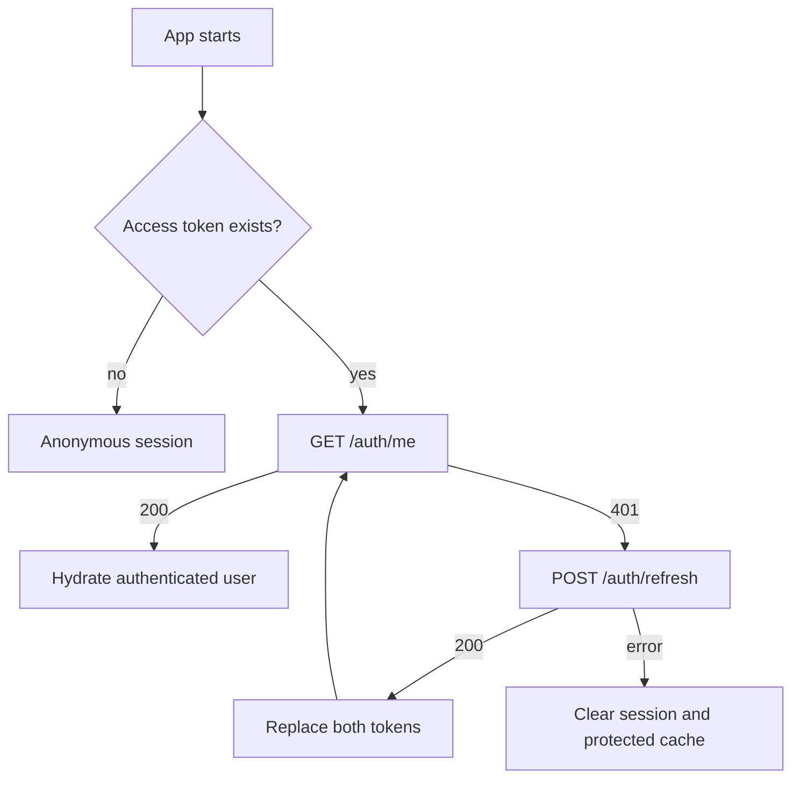
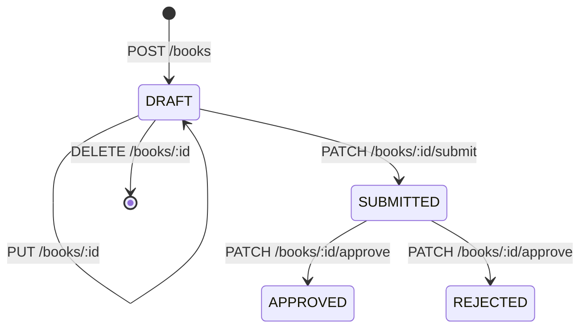
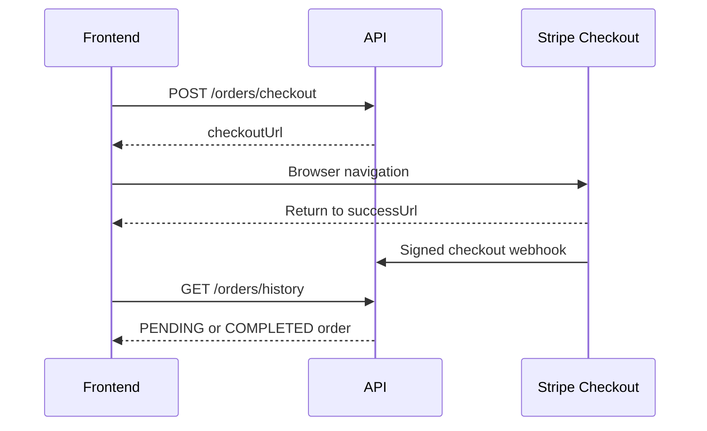

# Wonder Emporium — Frontend API Integration Guide

This is the frontend team's implementation contract for the Wonder Emporium API. It is organized by feature and recommended delivery order so each module can be implemented, tested, and released independently.

The backend source code and the files in this directory remain the source of truth. Update this guide whenever an endpoint contract or flow changes.

| File                      | Purpose                                     |
| ------------------------- | ------------------------------------------- |
| `README.md`               | Frontend implementation guide and API flows |
| `openapi.json`            | Generated OpenAPI contract used by tooling  |
| `openapi.yaml`            | YAML representation of the OpenAPI contract |
| `postman-collection.json` | Importable Postman collection               |

## 1. Start here

### Environments

| Environment | API base URL                        |
| ----------- | ----------------------------------- |
| Local       | `http://localhost:5000/v1`          |
| Deployed    | `${API_ORIGIN}/v1`                  |
| Swagger UI  | `${API_ORIGIN}/docs` (when enabled) |

API versioning is URI-based. Always include `/v1`. The generated OpenAPI file currently displays paths without this prefix, but runtime requests require it.

### Request conventions

- Send JSON with `Content-Type: application/json`, except book create/update, which use `multipart/form-data`.
- Protected endpoints require `Authorization: Bearer <accessToken>`.
- Access tokens last 15 minutes; refresh tokens last 7 days.
- Dates are ISO-8601 strings. Money values returned by commerce endpoints are decimal amounts in USD, not cents.
- Unknown request properties are rejected. Do not send UI-only form fields.
- The API accepts `X-Device`, `X-Device-Id`, and `X-Request-ID`; these are optional today.

### Universal response shape

Successful controller responses are wrapped globally:

```ts
type ApiSuccess<T> = {
  statusCode: number;
  message: 'Success';
  data: T;
};
```

Example:

```json
{
  "statusCode": 200,
  "message": "Success",
  "data": { "checkoutUrl": "https://checkout.stripe.com/..." }
}
```

Errors are not wrapped in `data`:

```ts
type ApiError = {
  success: false;
  statusCode: number;
  message: string;
  error: string;
  timestamp: string;
  path: string;
  stack: string | null;
};
```

Validation errors can combine multiple messages into one comma-separated `message`. Handle errors primarily by HTTP status and show `message` to the user when appropriate.

| Status        | Frontend action                                                   |
| ------------- | ----------------------------------------------------------------- |
| `400`         | Show field/request validation feedback                            |
| `401`         | Attempt one token refresh; if that fails, clear the session       |
| `403`         | Show an access-denied state                                       |
| `404`         | Show the feature's not-found state                                |
| `409`         | Show the conflict message (for example, email already registered) |
| `429`         | Disable retry briefly and show a rate-limit message               |
| `500` / `503` | Show a retryable service error and log the request ID             |

### Recommended client structure

```text
src/api/
├── client.ts              # base URL, JSON parsing, auth header, refresh
├── contracts.ts           # ApiSuccess, ApiError, shared enums
├── auth.api.ts
├── books.api.ts
├── orders.api.ts
├── authors.api.ts         # Stripe onboarding, payouts, statistics
└── admin.api.ts
```

Keep transport functions separate from UI state. A compact fetch client can unwrap `data` consistently:

```ts
const API_BASE_URL = `${import.meta.env.VITE_API_ORIGIN}/v1`;

export async function apiRequest<T>(
  path: string,
  init: RequestInit = {},
): Promise<T> {
  const response = await fetch(`${API_BASE_URL}${path}`, init);
  const payload = await response.json();

  if (!response.ok) throw payload as ApiError;
  return (payload as ApiSuccess<T>).data;
}
```

Add the bearer token, refresh queue, and framework-specific cache behavior in one interceptor/wrapper. When several requests receive `401` together, run only one refresh request and replay the others after it succeeds. Never retry more than once.

## 2. Shared contracts

```ts
type UserRole =
  | 'USER'
  | 'READER'
  | 'AUTHOR'
  | 'ADMIN'
  | 'MODERATOR'
  | 'SUPERADMIN';

type PublicRegistrationRole = 'USER' | 'READER' | 'AUTHOR';
type BookStatus = 'DRAFT' | 'SUBMITTED' | 'APPROVED' | 'REJECTED';
type OrderStatus = 'PENDING' | 'COMPLETED' | 'FAILED' | 'REFUNDED';
type PayoutStatus =
  | 'PENDING_REQUEST'
  | 'REQUESTED'
  | 'APPROVED'
  | 'PAID'
  | 'REJECTED';

type Tokens = { accessToken: string; refreshToken: string };

type AuthUser = {
  id: string;
  email: string;
  username: string;
  role: UserRole;
  verified: boolean;
  firstName?: string;
  lastName?: string;
  createdAt: string;
};

type AuthResult = { tokens: Tokens; user: AuthUser };

type BookFormat = {
  id?: string; // present in reads; omit in writes
  bookId?: string; // present in reads
  formatType: string;
  listPrice: number;
  sku?: string | null;
  pageCount?: number | null;
  trimSize?: string | null;
  coverUrl?: string | null;
  interiorUrl?: string | null;
};

type BookFile = {
  id: string;
  bookId: string;
  type:
    | 'COVER'
    | 'AUDIOBOOK'
    | 'EBOOK'
    | 'HARDCOVER'
    | 'PAPERBACK'
    | 'INTERIOR_PDF'
    | 'COVER_PDF';
  url: string | null;
  fileKey: string | null;
  mimeType: string | null;
  size: number | null;
  createdAt: string;
};

type Book = {
  id: string;
  authorId: string;
  title: string;
  description: string | null;
  bookCover: string | null;
  isbn: string | null;
  category: string | null;
  tags: string[];
  language: string | null;
  ageGroup: string | null;
  formats: BookFormat[];
  authorEarnings: number | null;
  publicationDetails: string | null;
  status: BookStatus;
  files: BookFile[];
  createdAt: string;
  updatedAt: string;
  sellingPrice?: number;
  printAvailable?: boolean;
  ebookAvailable?: boolean;
  audiobookAvailable?: boolean;
};

type PaginatedBooks = {
  books: Book[];
  total: number;
  page: number;
  limit: number;
  totalPages: number;
};
```

## 3. Recommended implementation order

| Phase | Frontend module                                                | Depends on          |
| ----- | -------------------------------------------------------------- | ------------------- |
| 1     | API client, error handling, auth storage and refresh           | Nothing             |
| 2     | Register, login, verification, password recovery, Google login | Phase 1             |
| 3     | Public catalog and book details                                | Phase 1             |
| 4     | Author book creation and submission                            | Phases 2–3          |
| 5     | Cart, Stripe Checkout, order history                           | Phases 2–3          |
| 6     | Customer library and secure digital access                     | Phases 2, 5         |
| 7     | Stripe Connect, author payouts and dashboard                   | Phases 2, 4–5       |
| 8     | Admin moderation, payouts and statistics                       | All prior contracts |

## 4. Phase 1–2: authentication and session flow

### Endpoint summary

| Method and path                      | Auth                           | Purpose                            |
| ------------------------------------ | ------------------------------ | ---------------------------------- |
| `POST /auth/register`                | Public                         | Create reader/user/author account  |
| `POST /auth/login`                   | Public                         | Email/password login               |
| `POST /auth/refresh`                 | Public (refresh token in body) | Rotate tokens                      |
| `GET /auth/me`                       | Bearer                         | Validate session/current principal |
| `POST /auth/logout`                  | Bearer                         | End the client session             |
| `POST /auth/verify-email`            | Public                         | Verify with emailed code           |
| `POST /auth/forgot-password`         | Public                         | Request reset code                 |
| `POST /auth/reset-password`          | Public                         | Reset using code                   |
| `POST /auth/change-password`         | Bearer                         | Change known password              |
| `POST /auth/google`                  | Public                         | Exchange Google ID token           |
| `GET /auth/google`                   | Public                         | Start redirect-based Google OAuth  |
| `GET /auth/google/callback?code=...` | Public                         | Backend OAuth callback             |

### Register

`POST /auth/register`

```ts
type RegisterBody = {
  firstName: string;
  lastName: string;
  email: string;
  password: string; // minimum 8 characters
  role: PublicRegistrationRole;
};
// response data: AuthResult
```

The server rejects privileged roles. Authors are created with an inactive account and may not be able to log in until an admin approves them. Readers/users are active immediately. Store returned tokens using the same policy as login, then route based on `user.role` and account behavior.

### Login, current user, refresh and logout

`POST /auth/login` body is `{ email, password }`; response data is `AuthResult`. Login is limited to 10 attempts per minute and can lock an account for 30 minutes after 5 failed passwords.

`POST /auth/refresh` body is `{ refreshToken }`; response data is a new `Tokens`. Replace **both** stored tokens because refresh-token rotation is enabled.

`GET /auth/me` has an exceptional double nesting in the current backend:

```json
{
  "statusCode": 200,
  "message": "Success",
  "data": {
    "data": {
      "id": "...",
      "email": "reader@example.com",
      "role": "READER",
      "tokenVersion": 0
    }
  }
}
```

Therefore an unwrapping client returns `{ data: principal }` for this endpoint. Do not expect the complete profile returned by login.

`POST /auth/logout` currently returns `{ message: "Logged out successfully" }`. Regardless of network outcome, the frontend should remove local tokens and protected cached data. The current controller does not receive or revoke a token server-side, so logout is effectively client-side.

Recommended startup flow:



### Email and password actions

| Endpoint                     | Body                           | Successful response data                                           |
| ---------------------------- | ------------------------------ | ------------------------------------------------------------------ |
| `POST /auth/verify-email`    | `{ email, code }`              | `{ message: "Email verified successfully" }` (or already verified) |
| `POST /auth/forgot-password` | `{ email }`                    | Generic `{ message }`; never reveal whether email exists           |
| `POST /auth/reset-password`  | `{ email, otp, password }`     | `{ message: "Password reset successfully" }`                       |
| `POST /auth/change-password` | `{ oldPassword, newPassword }` | `{ message: "Password changed successfully" }`                     |

Both new-password fields require at least 8 characters. After reset/change, clear the current session and ask the user to log in again because token versions are invalidated.

### Google login

Preferred SPA flow: obtain a Google ID token in the frontend, then call `POST /auth/google` with `{ idToken }`. Treat its response as `AuthResult`.

The redirect flow begins by navigating the browser to `${API_BASE_URL}/auth/google`. The callback currently returns API JSON rather than redirecting to a frontend page, so do not use that flow in an SPA until a frontend callback URL/token handoff is added.

## 5. Phase 3–4: books

### Public catalog endpoints

| Method and path               | Result                         |
| ----------------------------- | ------------------------------ |
| `GET /books`                  | Approved books only, paginated |
| `GET /books/approved`         | Same approved listing          |
| `GET /books/:id`              | One book                       |
| `GET /books/author/:authorId` | Books for an author, paginated |

List query fields actually accepted are:

```ts
type BookListQuery = {
  search?: string;
  category?: string;
  language?: string;
  page?: number; // default 1, minimum 1
  limit?: number; // default 20, range 1–100
  sortBy?: string; // default createdAt
  sortOrder?: 'asc' | 'desc'; // default desc
};
```

Although Swagger currently displays `tag`, `minPrice`, `maxPrice`, and `ageGroup`, the request DTO rejects these query keys. Do not send them until the backend contract is updated. Debounce catalog search and reset `page` to 1 whenever a filter changes.

### Author create/update payload

`POST /books` and `PUT /books/:id` use `FormData`; never manually set the multipart `Content-Type` header because the browser must add its boundary.

Text fields:

```ts
type BookWriteFields = {
  title: string; // create only: required, minimum length 2
  description?: string;
  isbn?: string;
  category?: string;
  tags?: string[];
  language?: string;
  ageGroup?: string;
  formats?: Array<{
    formatType: string;
    listPrice: number;
    sku?: string;
    pageCount?: number;
    trimSize?: string;
    coverUrl?: string;
    interiorUrl?: string;
  }>;
  authorEarnings?: number;
  publicationDetails?: string;
  printEdition?: {
    enabled: boolean;
    trimSize: string;
    bindingType: string;
    interiorColor: string;
    paperType: string;
    bookType: string;
    coverFinish: string;
    printQuality?: string;
    authorProfit?: number;
    sellingPrice?: number;
  };
};
```

File keys (maximum one file each): `bookCover`, `audiobook`, `ebook`, `hardcover`, `paperback`, `interiorPdf`, `coverPdf`.

Append arrays/objects as JSON strings. `tags` also accepts comma-separated text, but JSON is safer.

```ts
const form = new FormData();
form.append('title', values.title);
form.append('tags', JSON.stringify(values.tags));
form.append('formats', JSON.stringify(values.formats));
form.append('printEdition', JSON.stringify(values.printEdition));
if (values.bookCover) form.append('bookCover', values.bookCover);

await apiRequest<Book>('/books', {
  method: 'POST',
  headers: { Authorization: `Bearer ${accessToken}` },
  body: form,
});
```

Create returns a `Book` in `DRAFT`. Update only works while the book is `DRAFT`; show editing controls conditionally.

### Author/moderation lifecycle



| Endpoint                   | Intended role   | Body/result data       |
| -------------------------- | --------------- | ---------------------- | ---------------------------- |
| `PATCH /books/:id/submit`  | Author/ADMIN    | No body; `{ message }` |
| `DELETE /books/:id`        | Author/ADMIN    | No body; `{ message }` |
| `GET /books/pending`       | ADMIN/MODERATOR | `PaginatedBooks`       |
| `PATCH /books/:id/approve` | ADMIN/MODERATOR | `{ status: "APPROVED"  | "REJECTED" }`; `{ message }` |

After every mutation, invalidate the affected book detail, author list, pending list, and public catalog caches as applicable.

## 6. Phase 5: checkout and orders

### Checkout

`POST /orders/checkout` is protected for users, readers, authors, and admins.

```ts
type CheckoutBody = {
  items: Array<{ formatId: string; quantity: number }>;
  successUrl: string;
  cancelUrl: string;
};
// response data: { checkoutUrl: string }
```

Use the format `id` returned in `book.formats`, not the book ID. Use an absolute frontend URL for success/cancel. After receiving `checkoutUrl`, perform a full browser navigation. Do not mark an order paid from the success-page query string; Stripe's webhook is the payment source of truth.



The success page should poll order history briefly or offer refresh because webhook completion can arrive after browser redirection.

### Order history

`GET /orders/history?status=&startDate=&endDate=` returns an array ordered newest first. Dates use `YYYY-MM-DD`. Status values should use `OrderStatus`.

Each order includes its scalar database fields plus:

```ts
type Order = {
  id: string;
  buyerId: string;
  stripeSessionId: string;
  stripePaymentIntentId: string | null;
  status: OrderStatus;
  currency: string;
  subtotal: number;
  taxAmount: number;
  totalAmount: number;
  printCost: number | null;
  printJob: unknown | null;
  createdAt: string;
  updatedAt: string;
  items: Array<{
    id: string;
    bookId: string;
    formatId: string;
    authorId: string;
    unitPrice: number;
    quantity: number;
    taxAmount: number;
    totalPrice: number;
    book: { title: string; bookCover: string | null };
    format: { formatType: string };
  }>;
};
```

## 7. Phase 6: customer library

`GET /library` returns the logged-in buyer's ebook and audiobook order items from completed orders. Physical formats are intentionally excluded and remain visible in order history.

When the customer opens an item, call `POST /library/:orderItemId/access`. It verifies ownership and completed payment, then returns:

```ts
type LibraryAccess = {
  orderItemId: string;
  bookId: string;
  format: 'EBOOK' | 'AUDIOBOOK';
  accessType: 'DOWNLOAD' | 'STREAM';
  url: string;
  expiresIn: 300;
  mimeType: string | null;
  fileName: string;
};
```

The URL expires after five minutes. Request a new URL when it expires; never persist it as the library record.

## 8. Phase 7: author commerce

### Stripe Connect onboarding

| Endpoint                                 | Body/result data                            | UI behavior             |
| ---------------------------------------- | ------------------------------------------- | ----------------------- |
| `POST /commerce/author/onboard`          | `{ email, country? }` → `{ onboardingUrl }` | Navigate browser to URL |
| `GET /commerce/author/status`            | Status object below                         | Gate payout features    |
| `GET /commerce/author/express-dashboard` | `{ url }` or `{ url: null, message }`       | Open Stripe dashboard   |

Status is either `{ status: "NOT_CREATED" }` or:

```ts
{
  status: 'CREATED';
  stripeAccountId: string;
  chargesEnabled: boolean;
  payoutsEnabled: boolean;
}
```

An author is fully ready only when both flags are true. Re-check status when the user returns from Stripe onboarding. Onboarding and dashboard links are temporary; request a fresh link on each click.

### Author statistics and payouts

`GET /statistics/author` returns:

```ts
type AuthorStatistics = {
  totalPublishedBooks: number;
  totalSales: number;
  totalRevenue: number;
  revenueByDay: Array<{ date: string; revenue: number }>;
  revenueByMonth: Array<{ month: string; revenue: number }>;
};
```

`GET /payouts/author?status=` returns newest-first payout records. Each record contains `id`, `orderId`, `authorId`, `amount`, `platformFee`, `status`, `stripeTransferId`, timestamps, and `order: { id, status, createdAt, totalAmount }`.

`POST /payouts/author/:payoutId/request` moves a payout from `PENDING_REQUEST` to `REQUESTED` and returns the updated record. Disable the request button for every other status and while the request is in flight.

## 9. Phase 8: admin features

| Endpoint                                | Intended role    | Result/action           |
| --------------------------------------- | ---------------- | ----------------------- |
| `PATCH /admin/users/:id/approve`        | ADMIN/SUPERADMIN | Activate an author/user |
| `PATCH /admin/users/:id/suspend`        | ADMIN/SUPERADMIN | Suspend an account      |
| `GET /books/pending`                    | ADMIN/MODERATOR  | Moderation queue        |
| `PATCH /books/:id/approve`              | ADMIN/MODERATOR  | Approve/reject book     |
| `GET /payouts/admin?status=`            | ADMIN/SUPERADMIN | All platform payouts    |
| `POST /payouts/admin/:payoutId/approve` | ADMIN/SUPERADMIN | Trigger Stripe transfer |
| `GET /statistics/admin`                 | ADMIN/SUPERADMIN | Platform dashboard data |

Admin payout records additionally include `author: { email, username }` and `order: { id, createdAt, status }`. Approval should only be enabled for `REQUESTED`; the backend returns an error for invalid states. Treat payout approval as a non-idempotent financial action: require explicit confirmation, disable double submission, and refresh the record after completion.

`GET /statistics/admin` returns:

```ts
type AdminStatistics = {
  totalUsers: number;
  totalPublishedBooks: number;
  totalSales: number;
  totalGrossRevenue: number;
  totalPlatformRevenue: number;
  revenueByDay: Array<{ date: string; revenue: number }>;
  revenueByMonth: Array<{ month: string; revenue: number }>;
};
```

## 10. Other frontend-accessible endpoints

| Method and path     | Auth             | Notes                                                 |
| ------------------- | ---------------- | ----------------------------------------------------- |
| `POST /contact`     | Bearer           | Body `{ subject, message }`; sends a message to admin |
| `GET /`             | Public           | Basic API response                                    |
| `GET /health`       | Public           | Liveness only; not needed by product UI               |
| `GET /ready`        | Public           | Dependency readiness; useful for deployment checks    |
| `GET /metrics/json` | Public currently | Operational data; not a product UI dependency         |

`POST /webhooks/stripe` and `POST /webhooks/stripe/connect` are Stripe-to-backend endpoints. The frontend must never call them or attempt to manufacture webhook events.

## 11. Frontend acceptance checklist

For each endpoint/module:

- Add typed request and unwrapped response contracts.
- Test loading, empty, success, validation, unauthorized, forbidden, and server-error states.
- Confirm the request uses `/v1` and sends only accepted fields.
- Prevent duplicate submissions and cancel stale list/search requests.
- Invalidate or update cached data after mutations.
- Hide role-specific navigation using `user.role`, while still handling server-side `403`.
- Do not log passwords, OTPs, access tokens, refresh tokens, Stripe URLs, or full error stacks.
- Add a contract test or mock fixture based on the global envelope, not a bare payload.

## 12. Known contract gaps to coordinate with backend

These are current implementation facts, not frontend tasks to work around silently:

1. OpenAPI paths omit the runtime `/v1` prefix and most response schemas are only descriptions.
2. `/auth/me` adds its own `{ data }` inside the global `{ data }` wrapper.
3. `/auth/logout` does not currently revoke a server-side token.
4. Redirect-based Google OAuth returns JSON at the backend callback instead of redirecting to the frontend.
5. Swagger advertises book filters (`tag`, `minPrice`, `maxPrice`, `ageGroup`) that the DTO does not accept.
6. Several controllers declare `@Roles(...)` without attaching `RolesGuard`. The UI should follow the intended roles in this guide, but authorization must be fixed/enforced by the backend; hiding buttons is not security.
7. Checkout request DTOs and contact request DTO currently have no runtime validation decorators.
8. There is no public/admin user-list endpoint, so the frontend cannot discover IDs for the user approval screen from this API alone.

Resolve these gaps in backend contracts before relying on the affected behavior in production.
